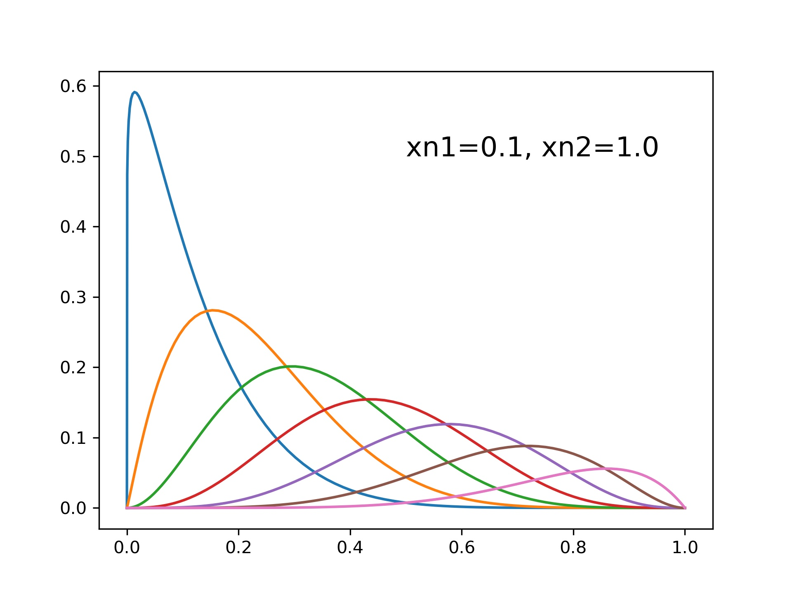
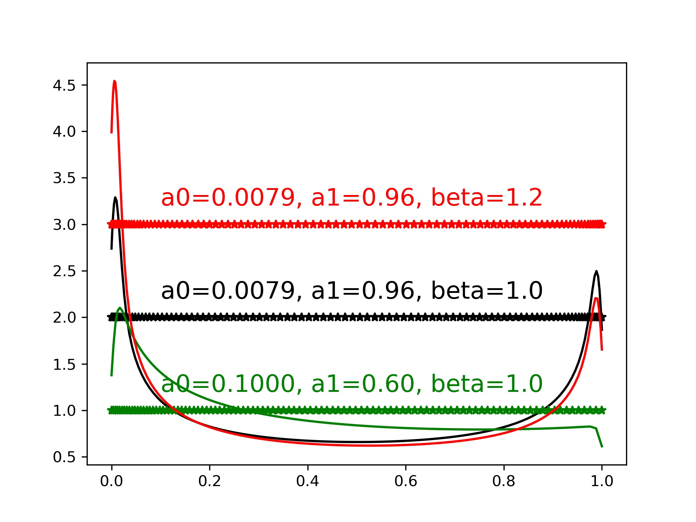

2D curve generation
=======================

CST base function
------------------------

.. figure:: ../../../tutorial/figures/cst_base_function-1.jpg
   :width: 70 %
   :align: center

Cosine distribution (X axis)
------------------------------

The solid line is the gaussian density estimation of the point distribution.
The stars show the actual point distribution. The three different colors show
the influence of the control parameter `a0`, `a1`, and `beta`.

.. code-block::
   xx = dist_clustcos(101, a0=0.0079, a1=0.96, beta=1.0)

