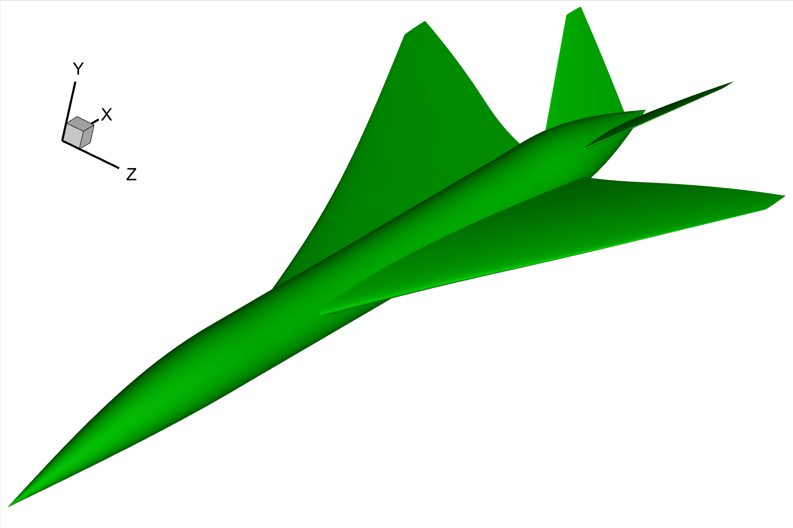

Aircraft
===================

Codes: :download:`aircraft.py <../../../example/supersonic-aircraft/aircraft.py>`

Supersonic aircraft
--------------------------------------

Generate a supersonic aircraft, including the fuselage, wing and v-tail.
The surfaces are smoothed to ensure the validity of the sonic boom prediction.

A new class `Fuselage` is defined to build the fuselage.
It is a subclass of `BasicSurface`, and the major difference is that the 'span-wise' direction 
is changed from the `z` direction to the `x` direction.
In consequence, the 3D section profile is in y-z plane.

.. _supersonic_aircraft_1:

    Supersonic aircraft based on the Lockheed Martin 1021 test case
