Airfoil
====================

Build an airfoil
--------------------

:download:`airfoil.py <../../../example/airfoil-basic/airfoil.py>`

This example demonstrates how to build an airfoil with CST parameters,
using the :func:`cst_foil <cst_modeling.section.cst_foil>` function.
It takes the CST parameters of the upper surface and lower surface as input.
You need to specify the number of points on the airfoil with `n`.
You can provide a reference x-coordinate distribution with `x`.
You can specify the maximum relative thickness of the airfoil :math:`t_\text{max}` with `t`.
You can also add a trailing edge thickness with `tail`.
Then, it returns the x-coordinates, y-coordinates of the upper surface and lower surface, 
the maximum thickness, and the leading edge radius.

.. code-block:: python
    :linenos:

    import numpy as np
    from cst_modeling.section import cst_foil

    cst_u = np.array([ 0.118598,  0.118914,  0.155731,  0.136732,  0.209265,  0.148305,  0.193591])
    cst_l = np.array([-0.115514, -0.134195, -0.109145, -0.253206, -0.012220, -0.118463,  0.064100])

    x1, yu1, yl1, tmax1, rLE1 = cst_foil(201, cst_u, cst_l, x=None, t=None, tail=0.0)
    x2, yu2, yl2, tmax2, rLE2 = cst_foil(201, cst_u, cst_l, x=None, t=None, tail=0.004)
    x3, yu3, yl3, tmax3, rLE3 = cst_foil(201, cst_u, cst_l, x=None, t=0.11, tail=0.004)

.. _airfoil_1:
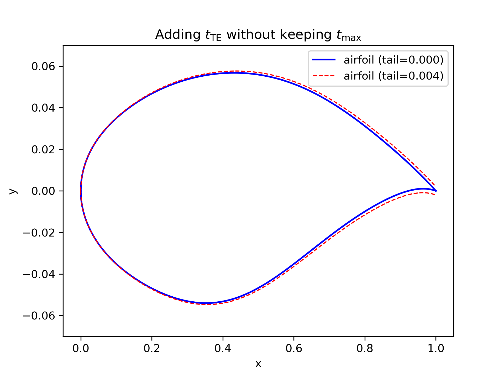

    Airfoil with and without trailing edge thickness

.. _airfoil_2:
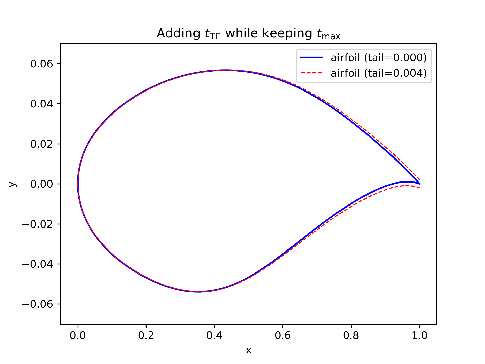

    Airfoil with and without trailing edge thickness (same :math:`t_\text{max}` ).

Fit airfoil raw data points
-----------------------------

:download:`fit-and-output.py <../../../example/airfoil-fitting/fit-and-output.py>`

Sometimes, you may have raw data points of an airfoil and want to get the CST parameters.
This example demonstrates how to fit the CST parameters from raw data points,
using the :func:`cst_foil_fit <cst_modeling.section.cst_foil_fit>` function.
You need to provide the raw data points of the upper surface and lower surface,
i.e., `xu0, yu0, xl0, yl0`. You can also specify the number of CST parameters with `n_cst`.

.. code-block:: python
    :linenos:

    from cst_modeling.section import cst_foil_fit

    cst_u, cst_l = cst_foil_fit(xu0, yu0, xl0, yl0, n_cst=10)

.. _airfoil_fitting:
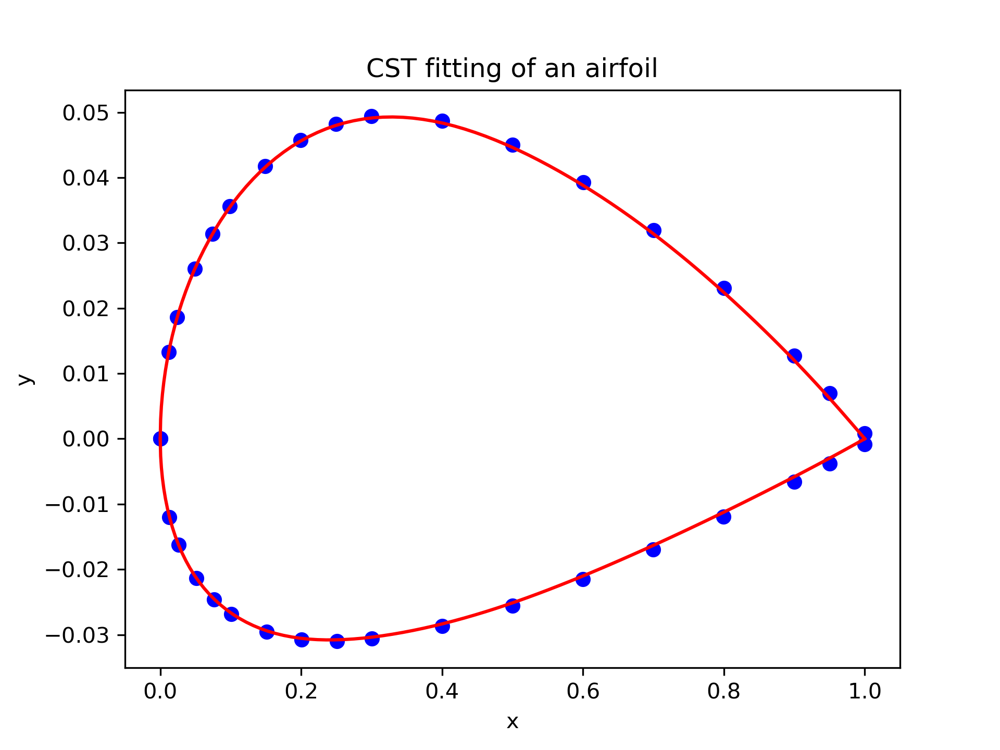

    Fitting airfoil raw data points with CST method.

Airfoil data output
--------------------

When you need to output the airfoil data to a file, you can use the following code.
The :func:`output_foil <cst_modeling.basic.output_foil>` function outputs the 2D airfoil data in the Tecplot format.
The :func:`output_plot3d <cst_modeling.basic.output_plot3d>` function outputs the 2D airfoil data in the Plot3D format.
The :func:`output_curves_igs <cst_modeling.basic.output_curves_igs>` function outputs the 2D airfoil data in the IGES format.

.. code-block:: python
    :linenos:

    from cst_modeling.section import cst_foil
    from cst_modeling.basic import output_foil, output_curves_igs, output_plot3d

    xx, yu, yl, _, _ = cst_foil(101, cst_u, cst_l, x=None, t=None, tail=0.0)

    output_foil(xx, yu, yl, fname='airfoil-2d.dat')

    x = [xx[None,:], xx[None,:]]
    y = [yu[None,:], yl[None,:]]
    z = [np.zeros_like(x[0]), np.zeros_like(x[0])]

    output_plot3d(x, y, z, fname='airfoil-2d.xyz')
    
    x = np.concatenate(x, axis=0)*1000
    y = np.concatenate(y, axis=0)*1000
    z = np.zeros_like(x)
    
    output_curves_igs(x, y, z, fname='airfoil-2d.igs', n_degree=3, is_planar=True)

Build a 3D airfoil
--------------------

:download:`airfoil.py <../../../example/airfoil-basic/airfoil.py>`

Sometimes, you may need to build a 3D airfoil from the 2D airfoil data.
Then, you need the :class:`BasicSection <cst_modeling.basic.BasicSection>`
and :class:`BasicSurface <cst_modeling.surface2.BasicSurface>` (or an old version :class:`BasicSurface <cst_modeling.basic.BasicSurface>`) classes.
You can specify how the surface is output, such as whether the upper and lower surfaces are output separately or together, 
or whether combine the span-wise sections into one piece. Please refer to the function document for details.

.. code-block:: python
    :linenos:

    from cst_modeling.basic import BasicSection, BasicSurface
    from cst_modeling.section import cst_foil

    #* Build a 2D section
    xx, yu, yl, _, _ = cst_foil(101, cst_u, cst_l, x=None, t=None, tail=0.0)

    airfoil = BasicSection(thick=None, chord=1.0, twist=0.0)
    
    airfoil.xx = xx
    airfoil.yu = yu
    airfoil.yl = yl

    #* Build a 3D surface
    geo3d = BasicSurface(n_sec=0, name='wing', nn=airfoil.xx.shape[0], ns=5)
    
    geo3d.secs = [airfoil]
    
    geo3d.geo()
    
    # Output Tecplot format and Plot3D format data
    geo3d.output_tecplot(fname='wing.dat')
    
    geo3d.output_plot3d(fname='wing.xyz')
    
    #* Format transformation: wing.xyz to wing.igs
    plot3d_to_igs(fname='wing')

.. _airfoil_3d:
.. figure:: ../../../example/airfoil-basic/airfoil-3d.png
    :width: 70 %
    :align: center

    3D airfoil surface

Extract geometric features
---------------------------

:download:`airfoil-geometric-features.py <../../../example/airfoil-features/airfoil-geometric-features.py>`

This example demonstrates how to extract geometric features from the airfoil data,
using the :class:`FoilGeoFeatures <cst_modeling.foil.FoilGeoFeatures>` class.

Geometric features:

- Leading edge radius
- Volume
- Thickness line
- Camber line
- Curvature
- Maximum thickness
- Thickness at 20% chord and 70% chord
- Maximum camber
- Average camber
- Weighted average camber
- Average camber of front 60% and rear 40%
- Leading edge slope angle
- Trailing edge wedge angle
- Trailing edge slope angle
- Upper crest point
- Lower crest point

.. _airfoil_features_1:
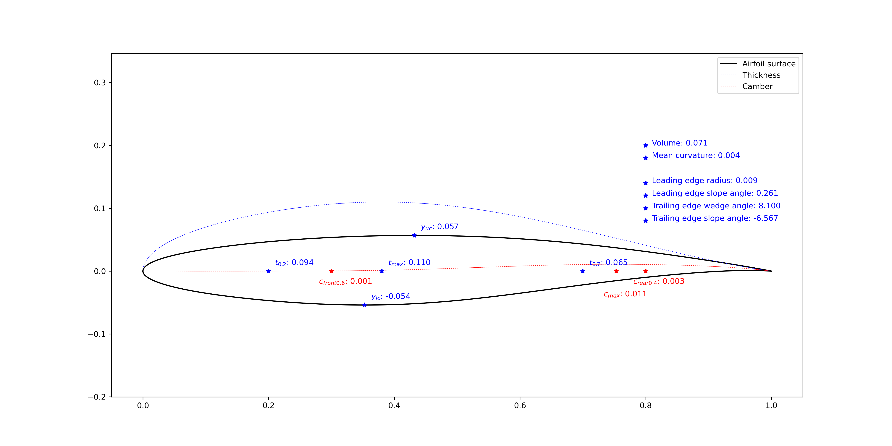

    Airfoil geometric features (tail=0.000)

.. _airfoil_features_2:
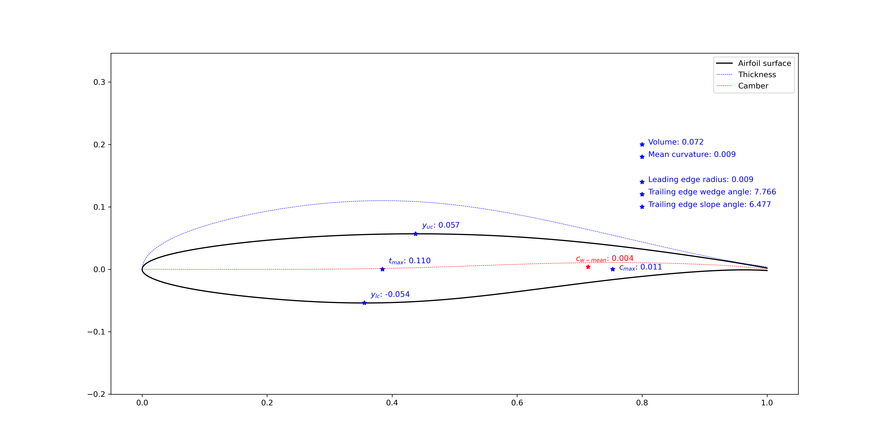

    Airfoil geometric features (tail=0.004)

Modify airfoil geometry
------------------------

:download:`airfoil-modification.py <../../../example/airfoil-modification/airfoil-modification.py>`

This example demonstrates how to modify the airfoil geometry,
using the :class:`FoilModification <cst_modeling.foil.FoilModification>` class.
You can modify the geometry by adding bumps and incremental curves,
the modified geometry will be reconstructed by the CST method with the specified number of CST parameters.

You can also add bumps to the airfoil thickness line or camber line.
Or set leading edge radius, trailing edge wedge angle and slope angle.

.. _airfoil_modify_1:
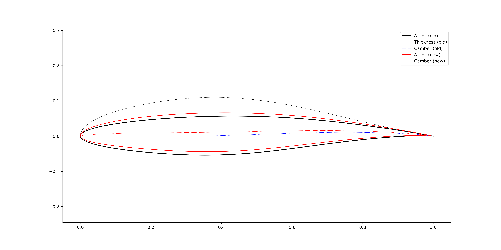

    Increase airfoil camber in a global sense (bump center = 0.3)

.. _airfoil_modify_2:
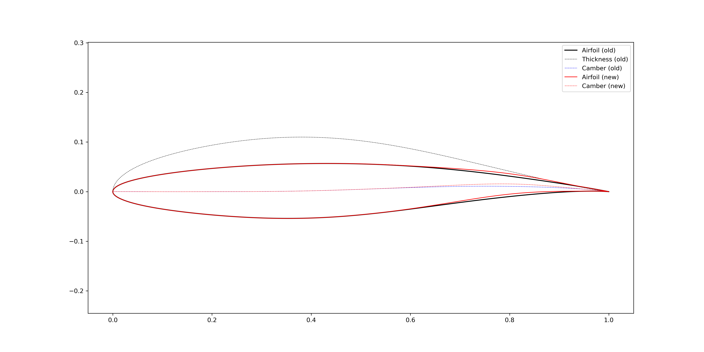

    Increase airfoil camber in the aft loading region (bump center = 0.8)

.. _airfoil_modify_3:
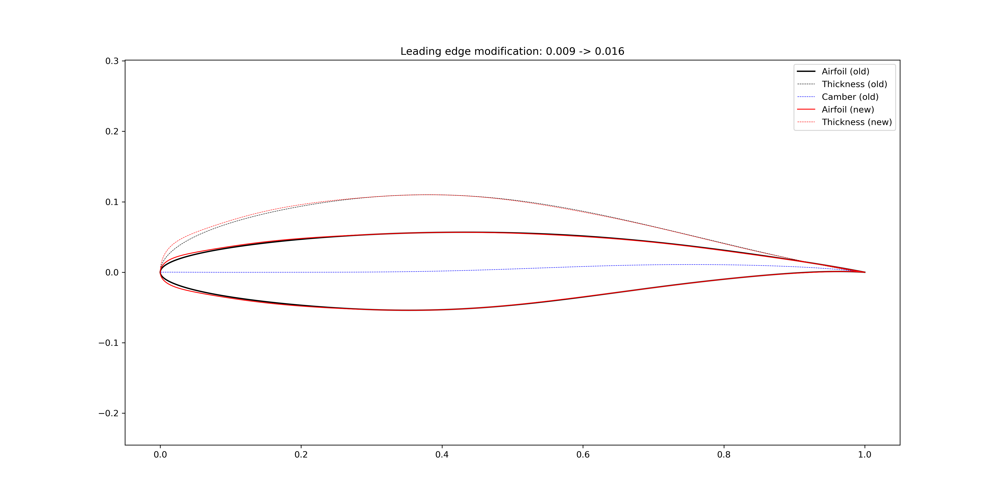

    Increase airfoil leading edge radius

.. _airfoil_modify_4:
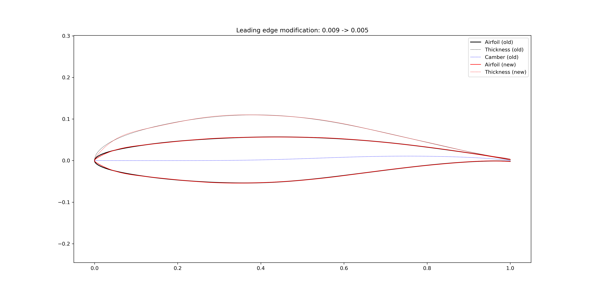

    Reduce airfoil leading edge radius

.. _airfoil_modify_5:
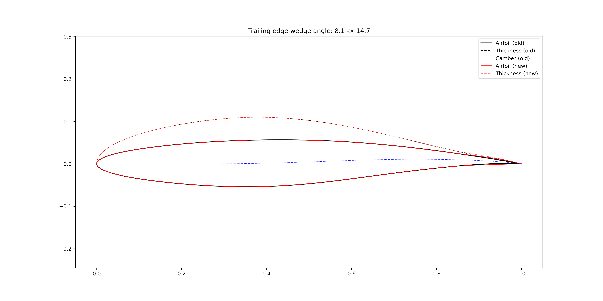

    Increase airfoil trailing edge wedge angle

.. _airfoil_modify_6:
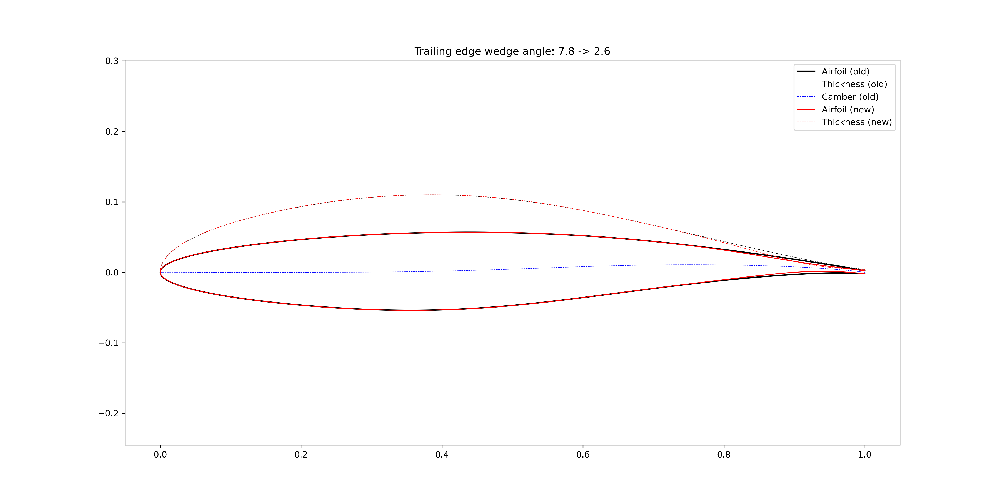

    Reduce airfoil trailing edge wedge angle

.. _airfoil_modify_7:
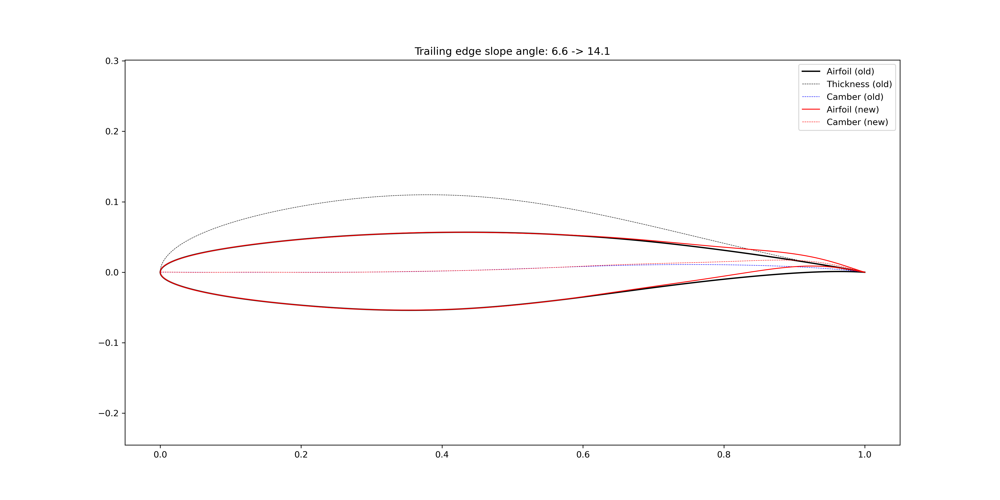

    Increase airfoil trailing edge slope angle

.. _airfoil_modify_8:

    Reduce airfoil trailing edge slope angle

You can also directly add bumps to the airfoil surface. 
In :numref:`airfoil_modify_9`, a bump centered at :math:`x=0.30` are added to the airfoil upper surface,
and a bump centered at :math:`x=0.85` are added to the airfoil lower surface.
When the airfoil maximum thickness is kept the same, the lower surface is affected by adding the bump to the upper surface.

.. _airfoil_modify_9:
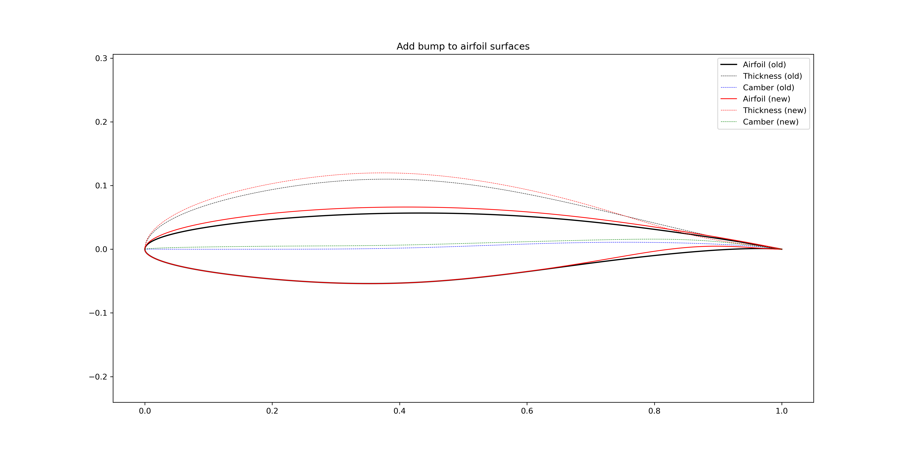

    Add bumps to the airfoil surfaces (not keep the :math:`t_\text{max}`)

.. _airfoil_modify_10:
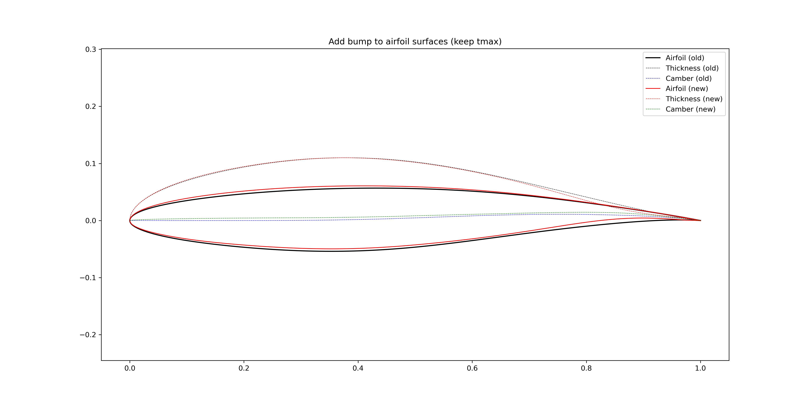

    Add bumps to the airfoil surfaces (keep the :math:`t_\text{max}`)
