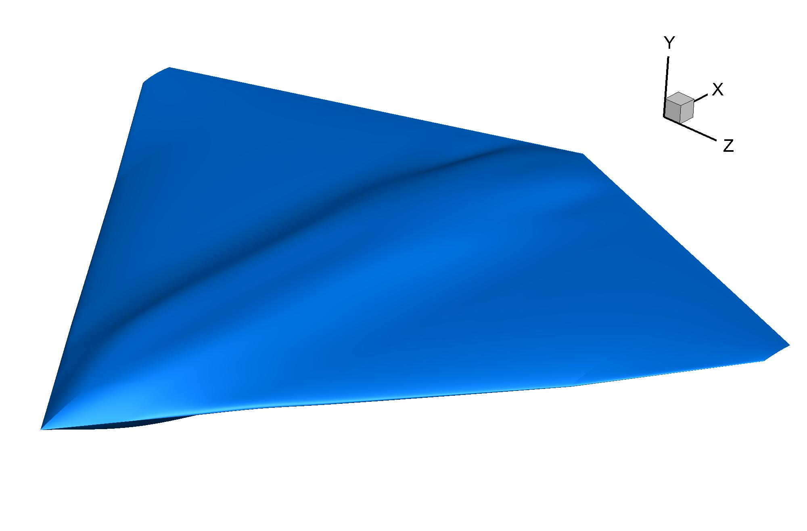
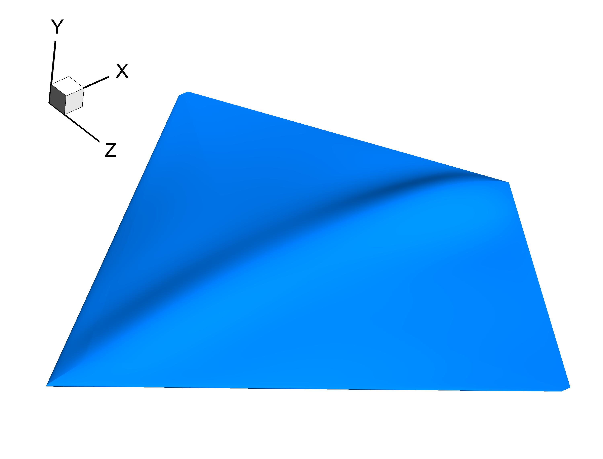
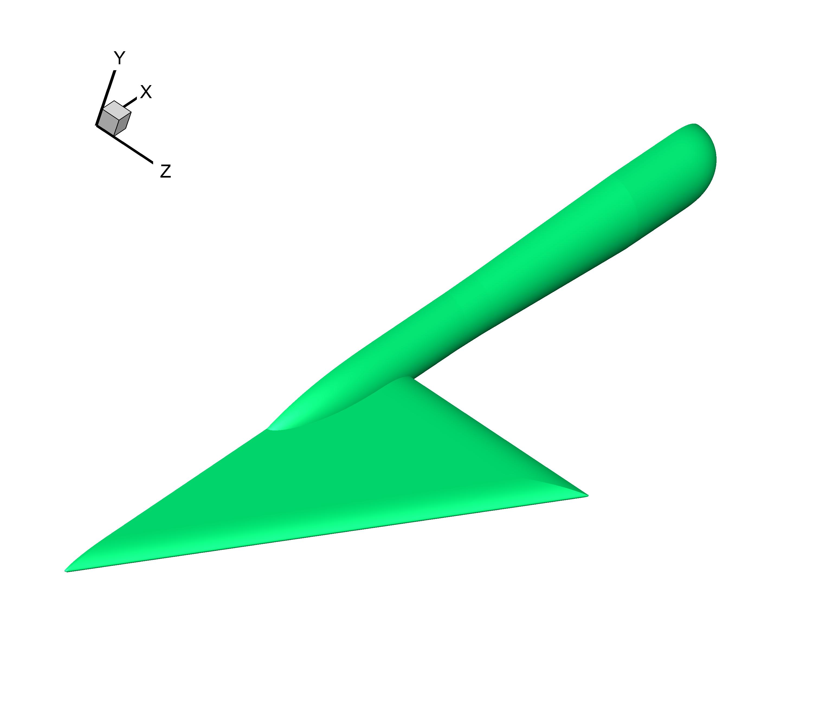

Delta wing
================

Diamond wing
--------------------------------------

Generate a diamond wing jet.

.. _diamond_wing_1:

    Diamond wing (1)

.. _diamond_wing_2:

    Diamond wing (2)

.. literalinclude:: ../../example/delta-wing.py
    :language: python
    :linenos:
    :caption: diamond_wing
    :pyobject: diamond_wing

VFE-2
--------------------------------------

Experimental Surface Pressure Data Obtained on 65° Delta Wing Across Reynolds Number
and Mach Number Ranges (Volume 2—Small-Radius Leading Edges)

https://ntrs.nasa.gov/archive/nasa/casi.ntrs.nasa.gov/19960025648.pdf

.. _vfe2_tecplot:

    VFE-2

