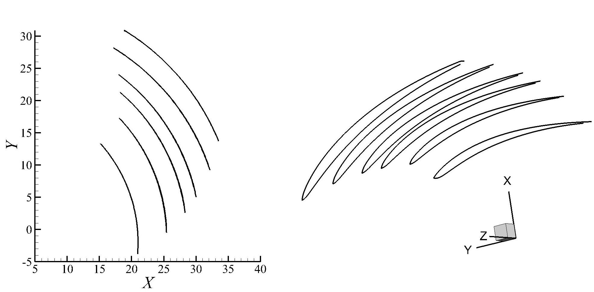
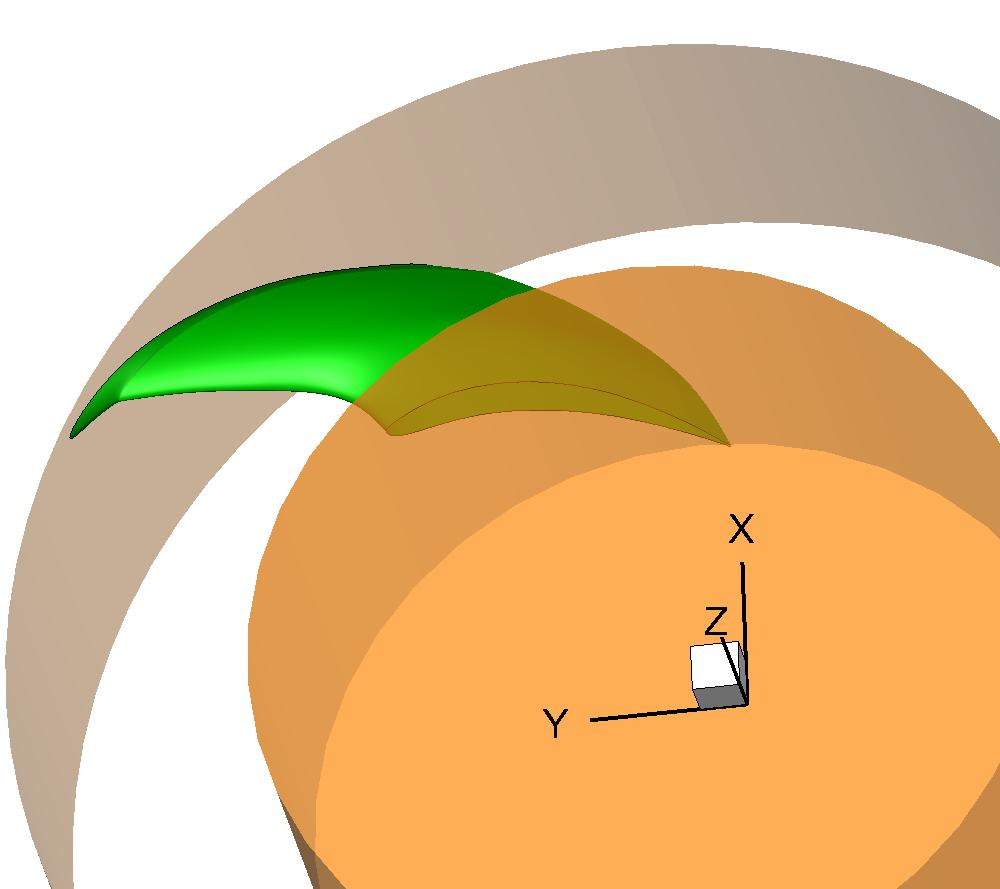
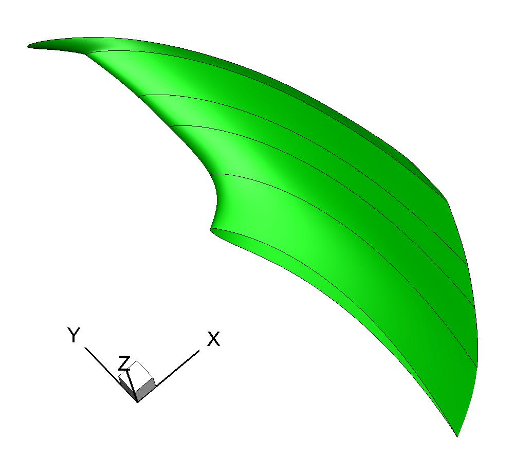

Turbomachinery
=====================

:download:`fan.py <../../example/fan.py>`

Fitting 3D blade sections
--------------------------

.. _fan_blade_sections:

    Fan blade sections

Fan blade
--------------------------

Generate 3D surfaces of a fan blade.

.. _fan_blade_1:

    Fan blade

.. _fan_blade_2:

    Fan blade

.. literalinclude:: ../../example/fan.py
    :language: python
    :linenos:
    :caption: fan_blade
    :pyobject: fan_blade
