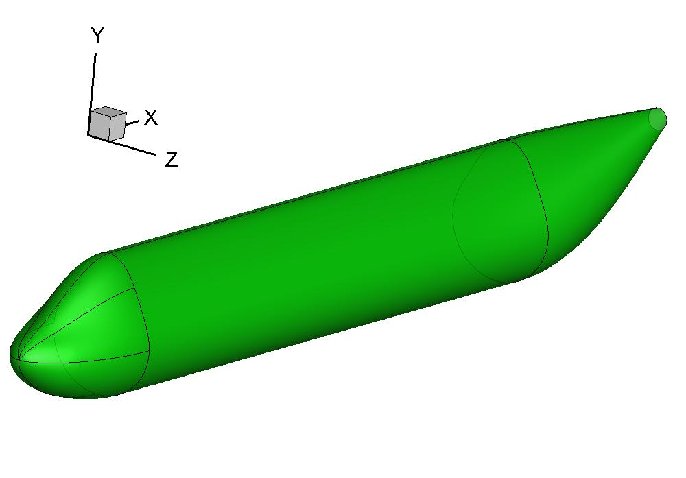
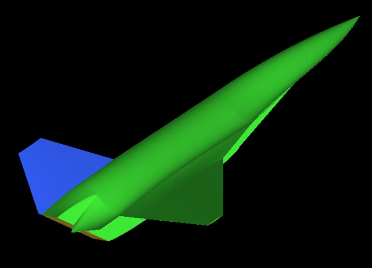
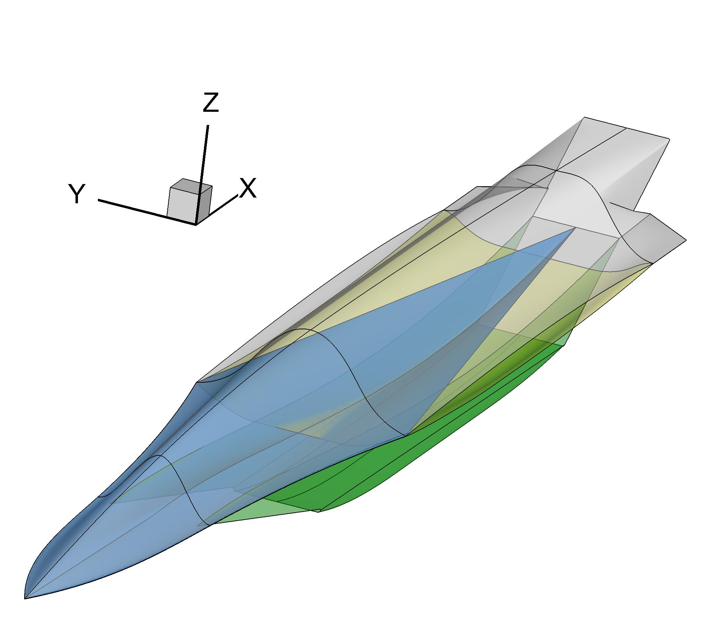
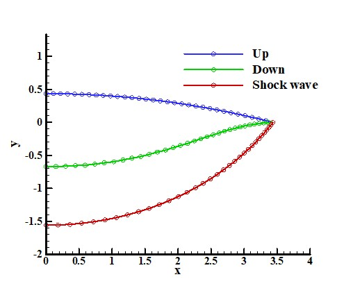

Fuselage
=====================

Civil aircraft fuselage
--------------------------

:download:`fuselage.py <../../example/fuselage.py>`

.. _fuselage:

    Civil aircraft fuselage

Hypersonic aircraft
--------------------------

:download:`hypersonic_aircraft.py <../../example/hypersonic_aircraft.py>`

.. _hypersonic_aircraft_1:

    Hypersonic aircraft

.. _hypersonic_aircraft_2:

    Fuselage of the hypersonic aircraft

Wave Rider
--------------------------

:download:`waverider.py <../../example/waverider.py>`

.. _waverider:

    Wave Rider Profile
