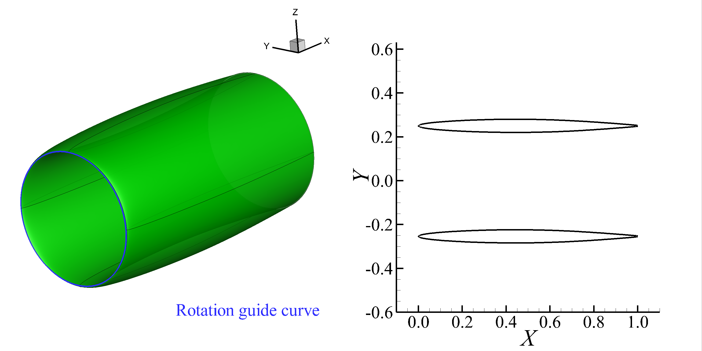
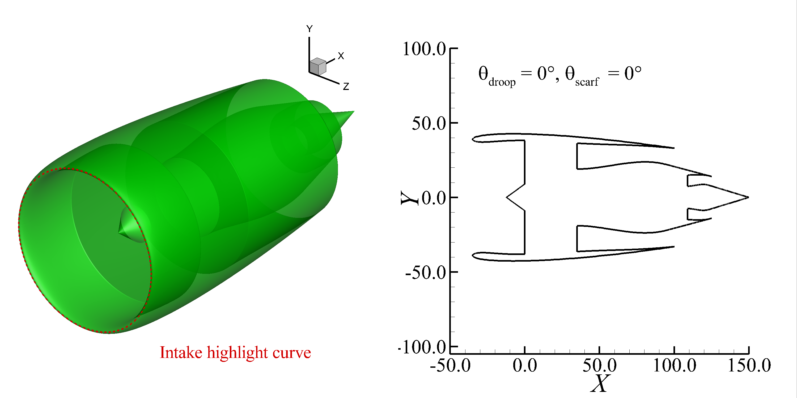
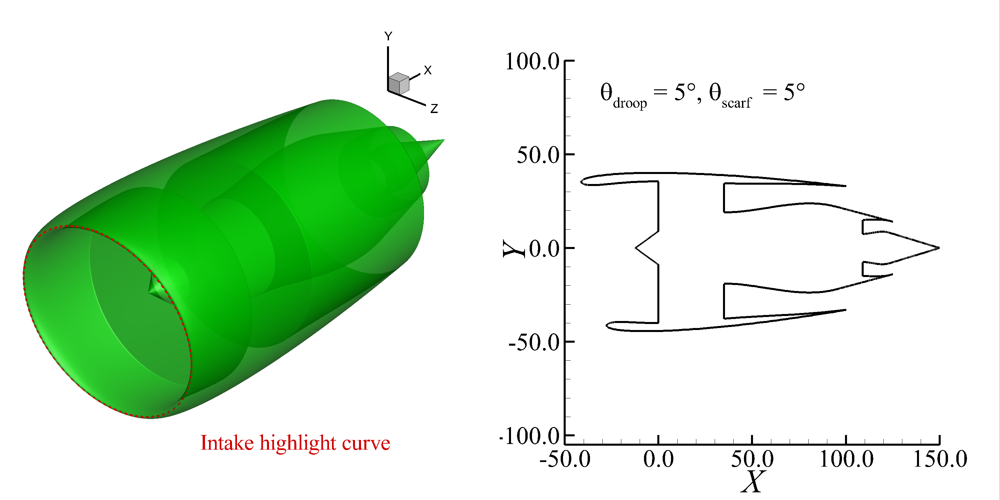
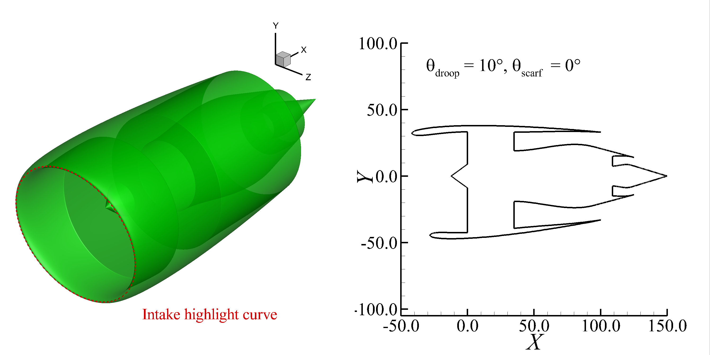
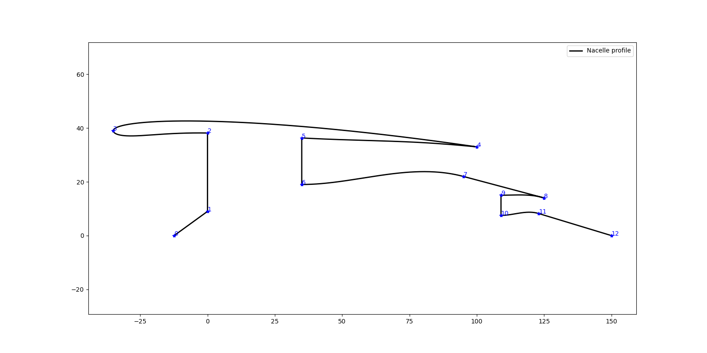

Nacelle
=====================

Flow through nacelle
--------------------------

Codes: 
:download:`nacelle-axisymmetric.py <../../../example/nacelle/nacelle-axisymmetric.py>`

Generate 3D surfaces of an axisymmetric flow through nacelle (FTN).
Use the :class:`Lofting_Revolution <cst_modeling.operation.Lofting_Revolution>` class
to generate the surface of rotation.

The result is shown in :numref:`nacelle_axisymmetric`.

.. _nacelle_axisymmetric:

    Flow through nacelle

Powered engine nacelle
--------------------------

Codes: 
:download:`nacelle-non-axisymmetric.py <../../../example/nacelle/nacelle-non-axisymmetric.py>`

Generate 3D surfaces of a non-axisymmetric powered engine nacelle (PEN).
Use the :class:`NacelleIntakeHighlight <cst_modeling.tools.nacelle.NacelleIntakeHighlight>` class
to generate the nacelle intake highlight curve.
Use the :class:`PoweredNacelleProfile <cst_modeling.tools.nacelle.PoweredNacelleProfile>` class
to generate the nacelle profile.

The axisymmetric PEN is shown in :numref:`nacelle_non_axisymmetric_1`,
the non-axisymmetric PENs are shown in :numref:`nacelle_non_axisymmetric_2` and :numref:`nacelle_non_axisymmetric_3`.

.. _nacelle_non_axisymmetric_1:

    Powered engine nacelle (axisymmetric)

.. _nacelle_non_axisymmetric_2:

    Powered engine nacelle (non-axisymmetric)

.. _nacelle_non_axisymmetric_3:

    Powered engine nacelle (non-axisymmetric)

The segment points of the powered engine nacelle profile are shown in :numref:`nacelle_profile`.

.. _nacelle_profile:

    Powered engine nacelle profile and segment points
