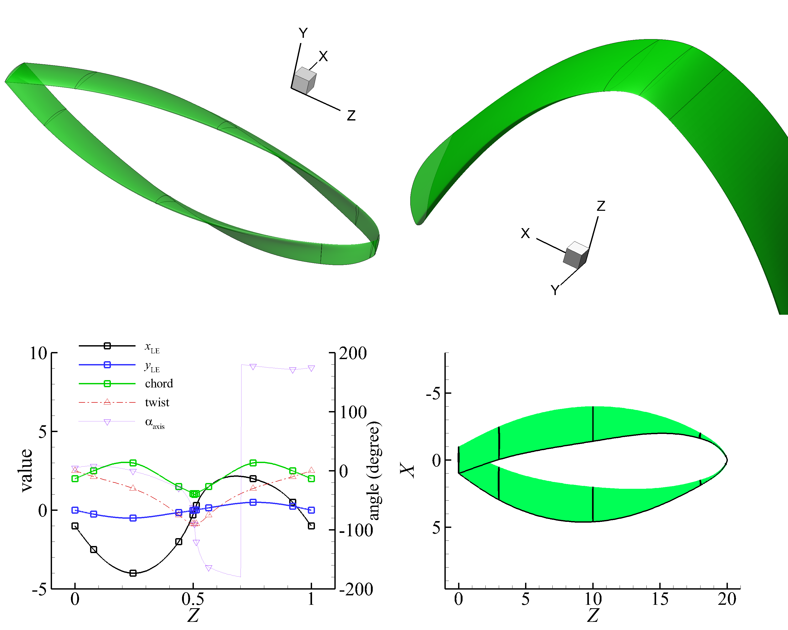

Propeller
============

Toroidal propeller
------------------

Codes: 
:download:`toroidal-propeller.py <../../../example/toroidal-propeller/toroidal-propeller.py>`
:download:`Propeller.txt <../../../example/toroidal-propeller/Propeller.txt>`

Generate a three-dimensional toroidal propeller.
Use the :func:`update_rotation_angle_with_tangent <cst_modeling.operation.GuideCurve.update_rotation_angle_with_tangent>` method
in :class:`GuideCurve <cst_modeling.operation.GuideCurve>` to update the 'rot_axis' distribution to align the tangent of the guide curve.

However, by default, a smooth surface generated by :class:`cst_modeling.surface2.BasicSurface`
has a piecewise linear interpolation of the z-coordinate of surface section leading edge `zLE`.
Consequently, the guide curve is not smooth at the leading edge, the tip of the toroidal propeller is not smooth.
Therefore, update the `zLE` distribution by spline interpolation of surface section `zLE` values,
using the :func:`generate_by_spline <cst_modeling.operation.GuideCurve.generate_by_spline>`
in :class:`GuideCurve <cst_modeling.operation.GuideCurve>` .

The result is shown in :numref:`toroidal_propeller`.

.. _toroidal_propeller:

    Toroidal propeller

