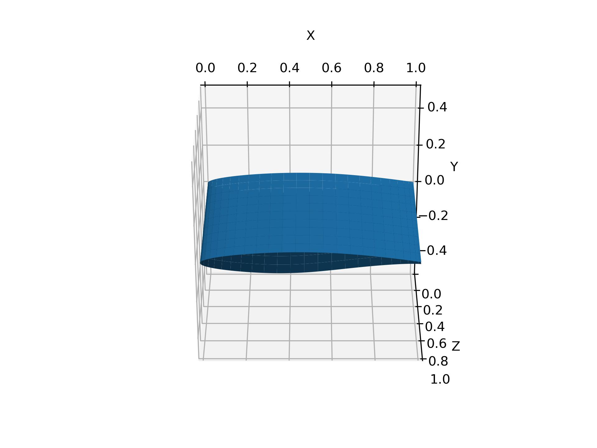
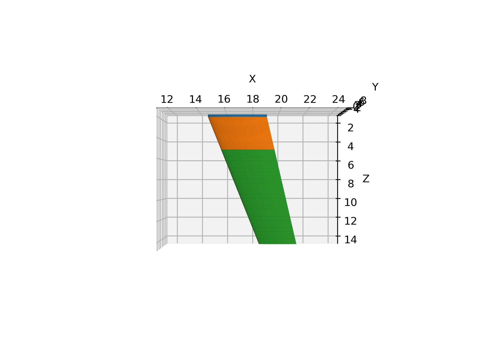

Swept wing
================

3D airfoil
--------------------------

Generate a 3D surface for airfoil meshing in ICEM CFD.

.. _airfoil3d:

    3D airfoil

.. literalinclude:: ../../example/swept-wing.py
    :language: python
    :linenos:
    :caption: airfoil3d
    :pyobject: airfoil3d

Transonic swept wing
--------------------------

Generate a 3D swept wing for transonic jets.

.. _transonic_wing:

    Transonic swept wing

.. literalinclude:: ../../example/swept-wing.py
    :language: python
    :linenos:
    :caption: transonic_wing
    :pyobject: transonic_wing

