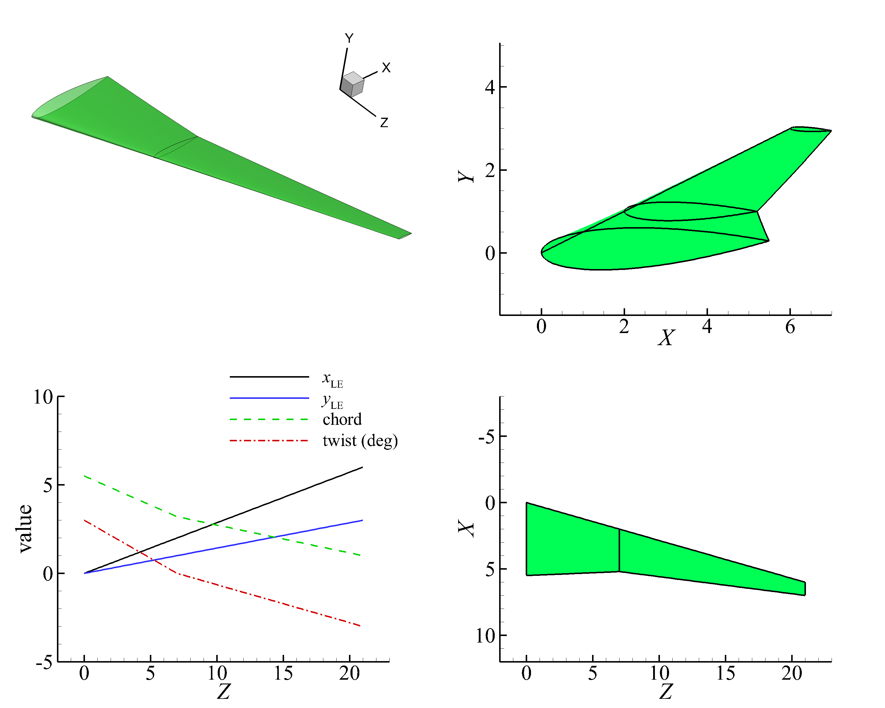
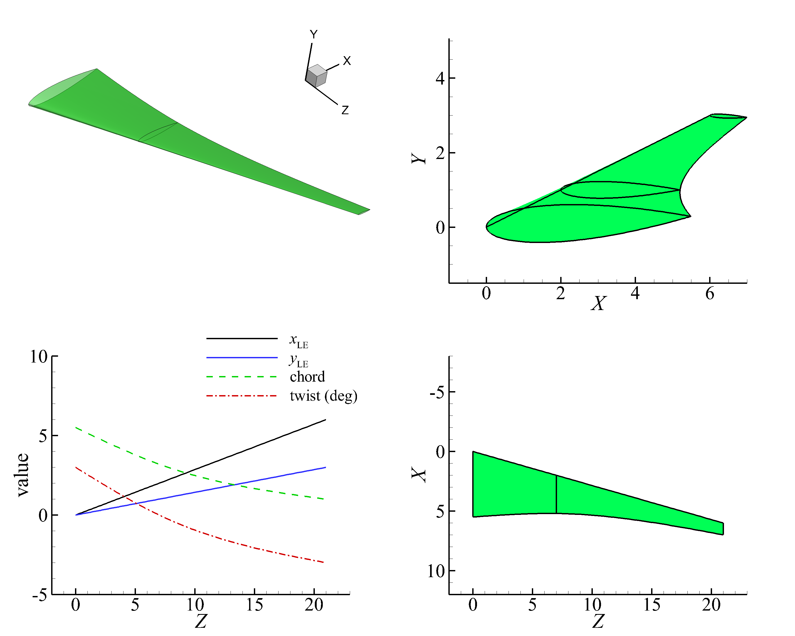
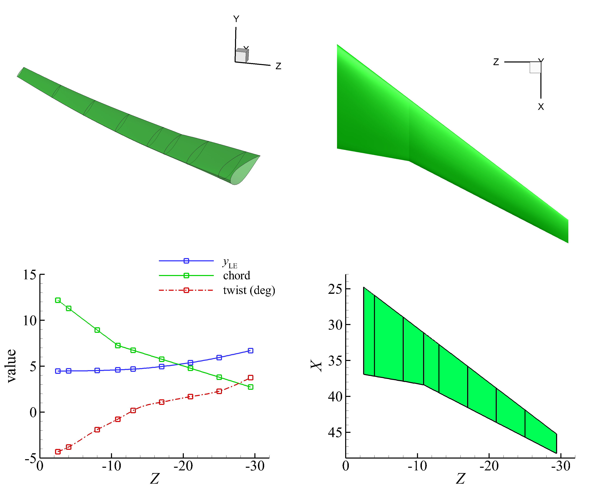
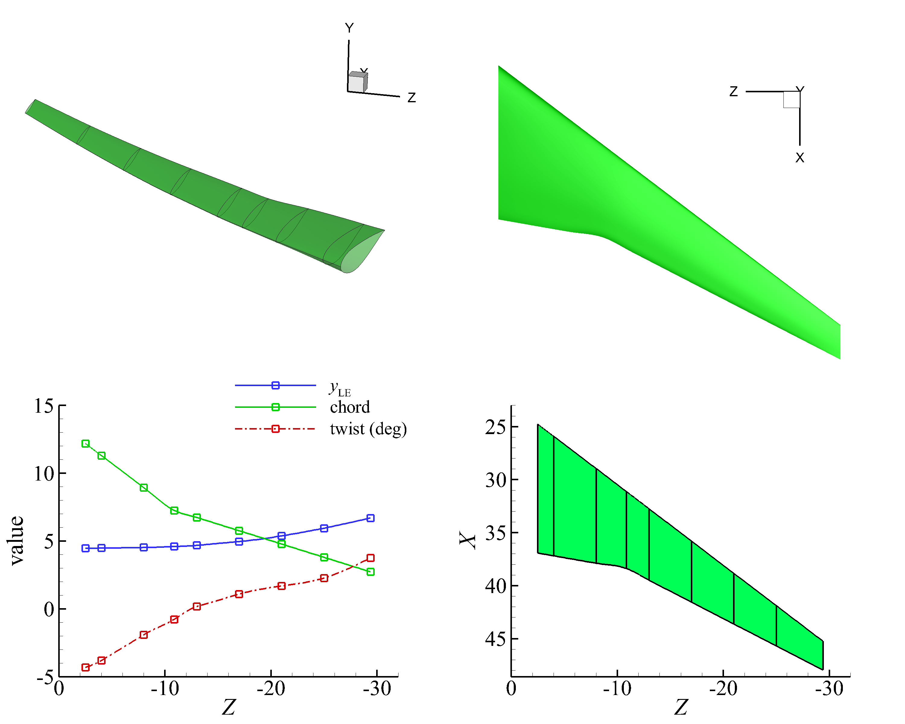
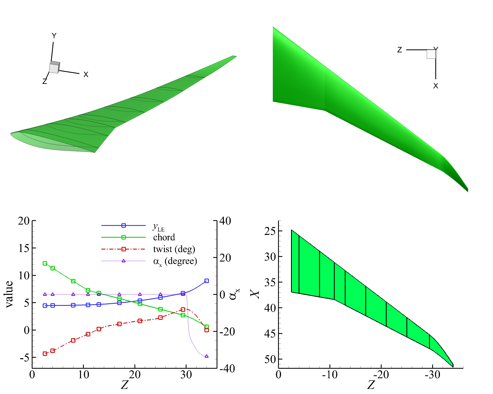

Wing
================

Simple swept wing
--------------------------

Codes: 
:download:`simple-wing.py <../../../example/wing-basic/simple-wing.py>`
:download:`Wing.txt <../../../example/wing-crm/Wing.txt>`
(:download:`simple-wing-old.py <../../../example/wing-basic/simple-wing-old.py>`)

Generate a three-dimensional simple swept wing.
By default, the surface is generated by piecewise linear interpolation, as shown in :numref:`wing_basic`.
A smooth surface can be generated by setting `smooth_surface` to `True` in :class:`BasicSurface <cst_modeling.surface2.BasicSurface>`, 
as shown in :numref:`wing_basic_smooth`.
The smooth surface is generated using :class:`Lofting <cst_modeling.operation.Lofting>` by cubic spline interpolation.

.. _wing_basic:

    Simple swept wing

.. _wing_basic_smooth:

    Simple swept wing (smooth surface)

Swept wing of CRM
-----------------------------------------------

Codes: 
:download:`wing-crm.py <../../../example/wing-crm/wing-crm.py>`
:download:`Wing.txt <../../../example/wing-crm/Wing.txt>`

Generate the three-dimensional swept wing for `NASA Common Research Model (CRM) <https://commonresearchmodel.larc.nasa.gov/>`_.
A smooth surface can be generated by setting `smooth_surface` to `True` in :class:`BasicSurface <cst_modeling.surface2.BasicSurface>`.

When `smooth_sections` = `None`, all sections are smoothed by cubic spline interpolation`.
Notice that the transonic wing has a kink, it has a sharp corner at the trailing edge.
It tends to overfit the spanwise chord length distribution, generating an unreasonable surface.

Therefore, the wing is divided into several sections, and each section is interpolated by a cubic spline,
using the `smooth_sections` parameter in :class:`BasicSurface <cst_modeling.surface2.BasicSurface>`.

The `smooth_sections` parameter is a list of tuples, 
each tuple contains the start and end index of the sections of the surface to be smoothed.
The surface's both ends are set to be tangent to the adjacent section's control point in the guide curve.

First choice is smoothing the surface in two sections: (0,2) and (4,8), as shown in :numref:`wing_crm_1`.
The `smooth_sections` = `[(0, 2), (4, 8)]`, the first surface between section 0 and 2 is smoothed, 
the left end is left free, and the right end is tangent to segment of control point 2 and 3. 
The second surface between section 4 and 8 is smoothed, the left end is tangent to segment of control point 3 and 4, 
and the right end is tangent to segment of control point 8 and 9. 
The surface between section 2 and 4 has a piecewise linear distribution.

The second choice is smoothing the surface in three sections, as shown in :numref:`wing_crm_2`.
The `smooth_sections` = `[(0, 1), (2, 4), (5, 8)]` means the first surface between section 0 and 1 is smoothed, 
the left end is left free, and the right end is tangent to segment of control point 1 and 2.
So, this sequential list of tuples defines a smooth surface.

.. _wing_crm_1:

    Transonic swept wing of NASA Common Research Model (CRM)

.. _wing_crm_2:

    Transonic swept wing of NASA CRM (smooth surface)

Swept wing with winglet
--------------------------------------

Codes: 
:download:`wing-crm-winglet.py <../../../example/winglet/wing-crm-winglet.py>`
:download:`Wing.txt <../../../example/winglet/Wing.txt>`

Generate a 3D swept wing with winglet.
Comparing to the standard NASA CRM wing, the winglet has a dihedral angle.
When the dihedral angle is large, the wing section needs to be rotated about the axis to keep the wing volume unchanged.

The surface section can be rotated by setting `rotate_x_section` to `True` in :class:`BasicSurface <cst_modeling.surface2.BasicSurface>`, 
the `rotation_sections` parameter is a list of tuples, 
each tuple contains the start and end index of the sections of the surface to be rotated about the x axis.

For winglets, rotating the wing section about x-axis is only necessary when the winglet is close to vertical.
The rotation sections can be just winglet sections, because usually we do not want to rotate the wing sections.
as shown in :numref:`transonic_wing_winglet`.

.. _transonic_wing_winglet:

    CRM swept wing with winglet

