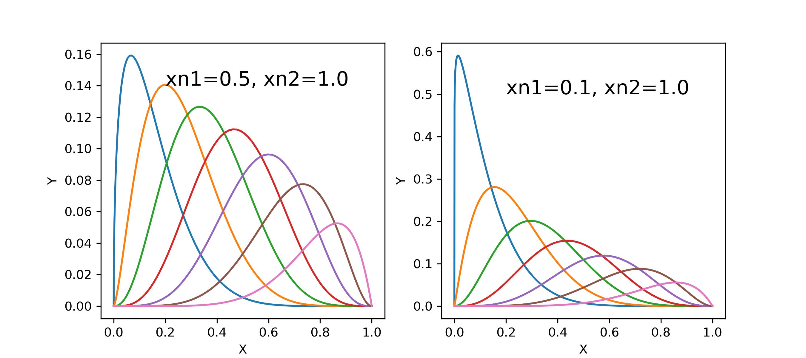
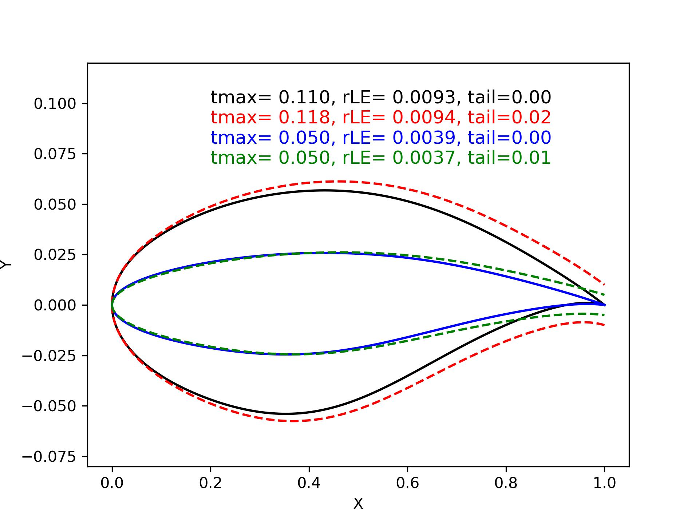
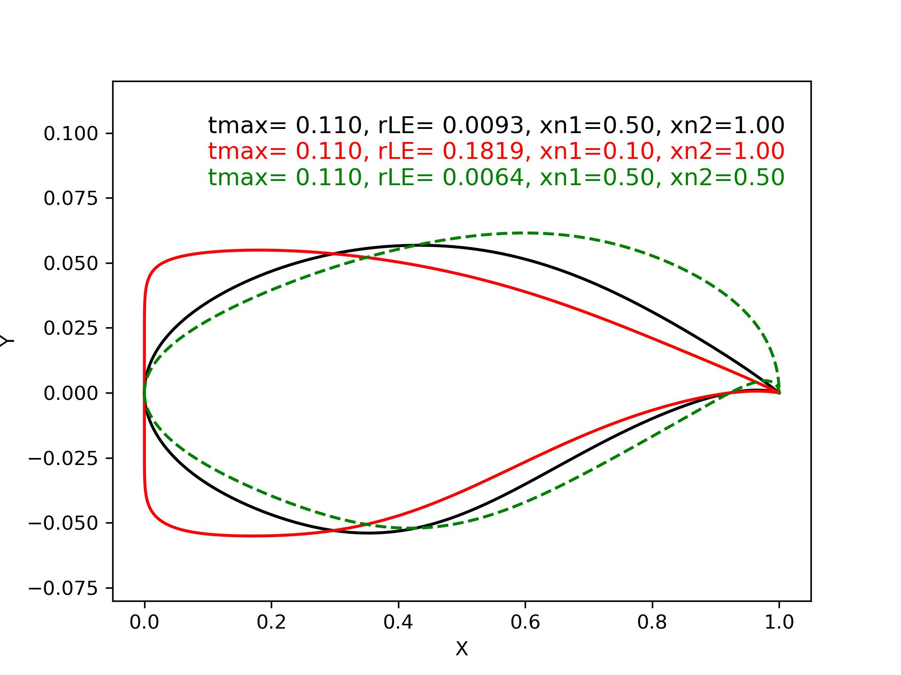
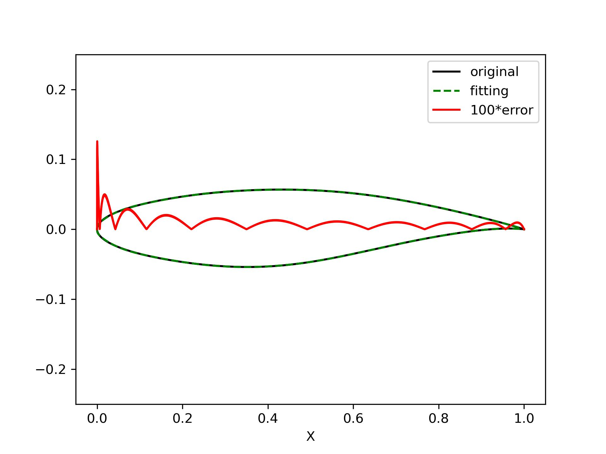
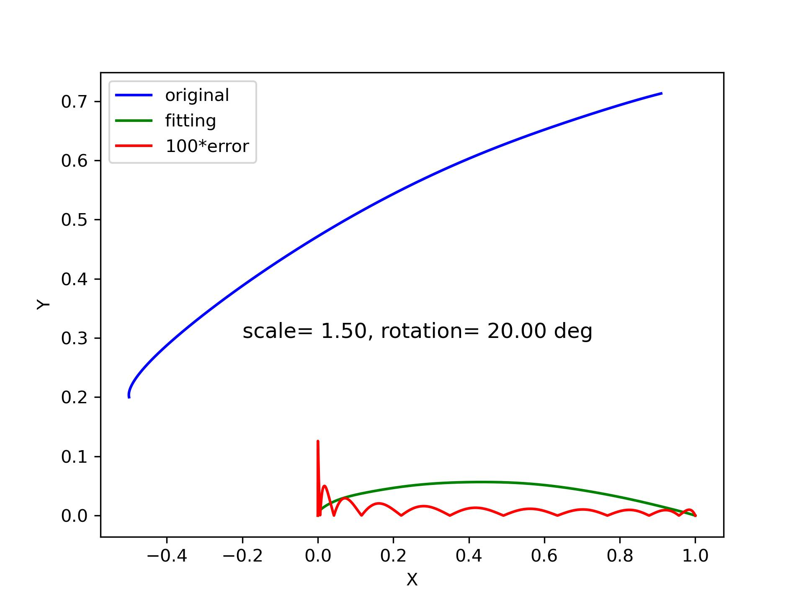
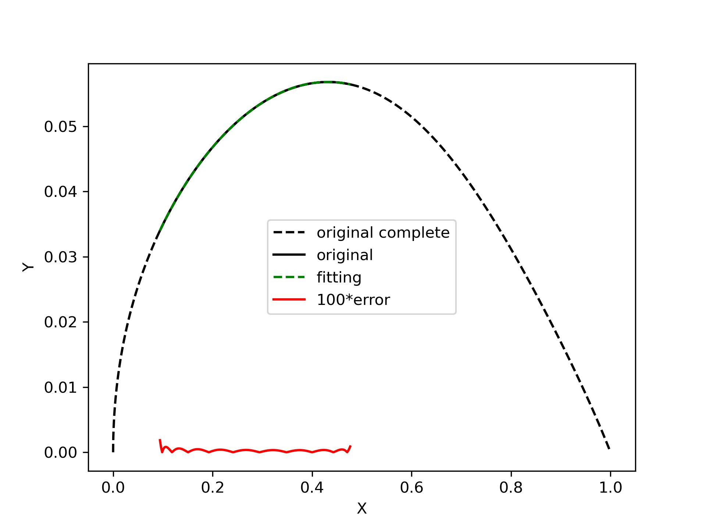

2D curve generation
=======================

CST base function
------------------------

The following figure shows the base functions of the 6-th order CST method.
The influence of parameter `xn1` and `xn2` is shown in the two sub-figures.

.. code-block:: python
    :linenos:
    
    x, y = cst_curve(101, cst, xn1=0.5, xn2=1.0)

    CST base function

Cosine distribution (X axis)
------------------------------

The following figure shows the density of a cosine distribution.
The solid line is the gaussian density estimation of the point distribution.
The stars show the actual points. The three different colors show
the influence of the control parameter `a0`, `a1`, and `beta`.

.. code-block:: python
    :linenos:
    
    xx = dist_clustcos(101, a0=0.0079, a1=0.96, beta=1.0)

.. figure:: ../../tutorial/figures/cosine_distribution.jpg
    :width: 70 %
    :align: center

    Cosine distribution

CST airfoil
------------------------------

The following figure shows the airfoil generated by CST method.
The four airfoils have the same CST coefficients, but their `t` and `tail` settings are different.

- The black airfoil is the original geometry defined by the `cst_u` and `cst_l`.
- The red airfoil adds a finite tail thickness to the original geometry.
- The blue airfoil applies a specified relative maximum thickness `t` to the original geometry.
- The green airfoil adds a finite tail thickness to an airfoil, of which the `t` is specified.

.. code-block:: python
    :linenos:
    
    x, yu, yl, tmax, rLE = cst_foil(1001, cst_u, cst_l, x=None, t=None, tail=0.0)   # black
    x, yu, yl, tmax, rLE = cst_foil(1001, cst_u, cst_l, x=None, t=None, tail=0.02)  # red
    x, yu, yl, tmax, rLE = cst_foil(1001, cst_u, cst_l, x=None, t=0.05, tail=0.0)   # blue
    x, yu, yl, tmax, rLE = cst_foil(1001, cst_u, cst_l, x=None, t=0.05, tail=0.01)  # green

    CST airfoil (changing t and tail)

The following figure shows the difference between airfoils when the CST parameter `xn1` and `xn2` are changed.
The four airfoils have the same CST coefficients, the maximum relative thickness `t` is also fixed.

A smaller `xn1` or `xn2` gives the CST method more power to describe the shape in the leading edge or trailing edge.
Sometimes, using a small `xn1` is suggested when the leading edge needs delicate modification. 

.. code-block:: python
    :linenos:
    
    x, yu, yl, tmax, rLE = cst_foil(1001, cst_u, cst_l, t=0.11)                   # black
    x, yu, yl, tmax, rLE = cst_foil(1001, cst_u, cst_l, t=0.11, xn1=0.1, xn2=1.0) # red
    x, yu, yl, tmax, rLE = cst_foil(1001, cst_u, cst_l, t=0.11, xn1=0.5, xn2=0.5) # green

    CST airfoil (changing xn1 and xn2)

Fitting airfoil
------------------------------

Given an airfoil, you can use CST method for fitting.

.. code-block:: python
    :linenos:
    
    cst_u, cst_l = cst_foil_fit(x, yu, x, yl, n_cst=10, xn1=0.3, xn2=1.0)

    Fitting airfoil with CST

Fitting curve
------------------------------

Given a curve, you can use CST method for fitting.
The curve can be a unit chord length curve, i.e., x in [0,1].
It can also have any end point, but it must be a function after 
being transformed back to a unit curve, i.e., `y=f(x)`.

.. code-block:: python
    :linenos:
    
    coef = fit_curve(x, y, n_cst=10, xn1=0.5, xn2=1.0)

    coef, scale, rotation, thick = fit_curve_with_twist(x, y, n_cst=10, xn1=0.5, xn2=1.0)

    coef = fit_curve_partial(x, y, ip0=200, ip1=501, ic0=2, ic1=11, n_cst=20, xn1=0.3, xn2=1.0)

    Fitting curve with CST

You can also use CST to fit part of a curve. Sometimes this can be useful.

    Fitting partial curve with CST

Curve curvature
------------------------------

Calculating the curvature of a curve is very useful in aerodynamic design. 

.. code-block:: python
    :linenos:
    
    curvature = curve_curvature(x, y)

.. figure:: ../../tutorial/figures/curve_curvature.jpg
    :width: 70 %
    :align: center

    Curve curvature

