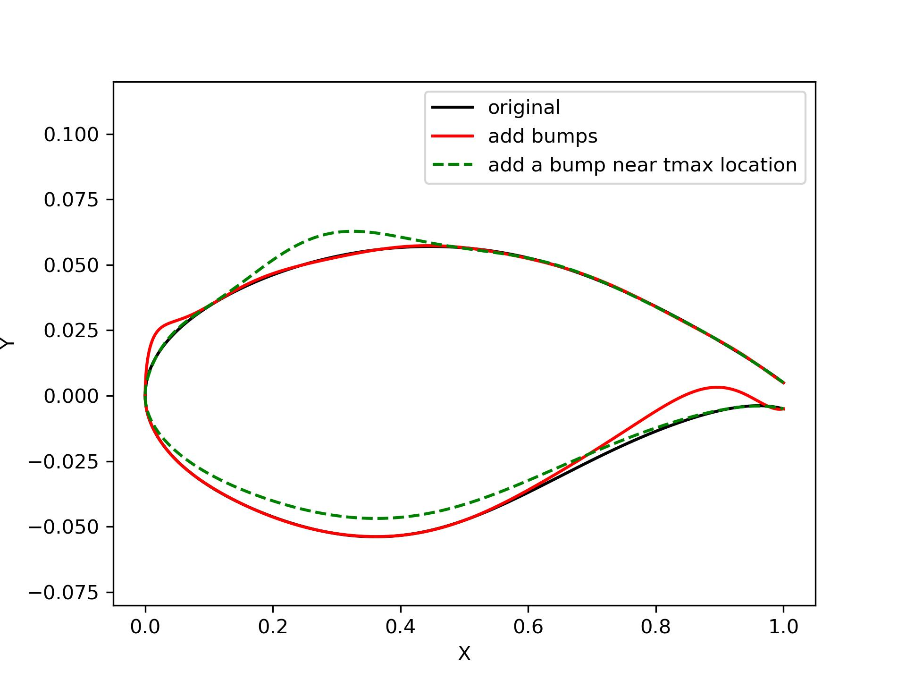

2D curve modification
========================

Bumps
------------------------

:numref:`bumps` shows the Gaussian and Hicks-Henne bump functions.

.. code-block:: python
    :linenos:
    
    y = bump_function(xx, xc, bump_height, s, kind='H')

.. _bumps:
.. figure:: ../../tutorial/figures/bumps.jpg
    :width: 90 %
    :align: center

    Bumps

Foil with incremental curves
-------------------------------

:numref:`foil_increment_curve` shows the result of adding incremental curves
to an airfoil (`foil_increment_curve`). The tail thickness will always be maintained.
The airfoil maximum relative thickness will be fixed if `t` is specified.
So, be careful when modifying geometry around the `tmax` location.
Function `foil_increment` will automatically add incremental curves defined by
`cst_u` and `cst_l`.

.. code-block:: python
    :linenos:
    
    yu_new, yl_new = foil_increment_curve(x, yu, yl, yu_i, yl_i, t=tmax)

    yu_new, yl_new = foil_increment(x, yu, yl, cst_u, cst_l, t=None)

.. _foil_increment_curve:
.. figure:: ../../tutorial/figures/foil_increment_curve.jpg
    :width: 70 %
    :align: center

    Foil with incremental curves

Foil modification with bumps
-------------------------------

:numref:`foil_bump_modification` shows the result of adding a bump to an airfoil (`foil_bump_modify`). 
The tail thickness will always be maintained. 
The airfoil maximum relative thickness will be fixed if `keep_tmax` is `True`.
**Note, it will scale the opposite side of `side` to keep the thickness.**
If `n_cst` is larger than zero, the new airfoil will be fitted with CST.
:numref:`foil_bump_modification` has the same bump parameters with :numref:`foil_increment_curve`.
The difference can be noticed, which is caused by CST fitting and the logic of `keep_tmax`.

.. code-block:: python
    :linenos:
    
    yu_new, yl_new = foil_bump_modify(x, yu, yl, xc, relative_height, s, n_cst=10, keep_tmax=True)

.. _foil_bump_modification:

    Foil modification with bumps

