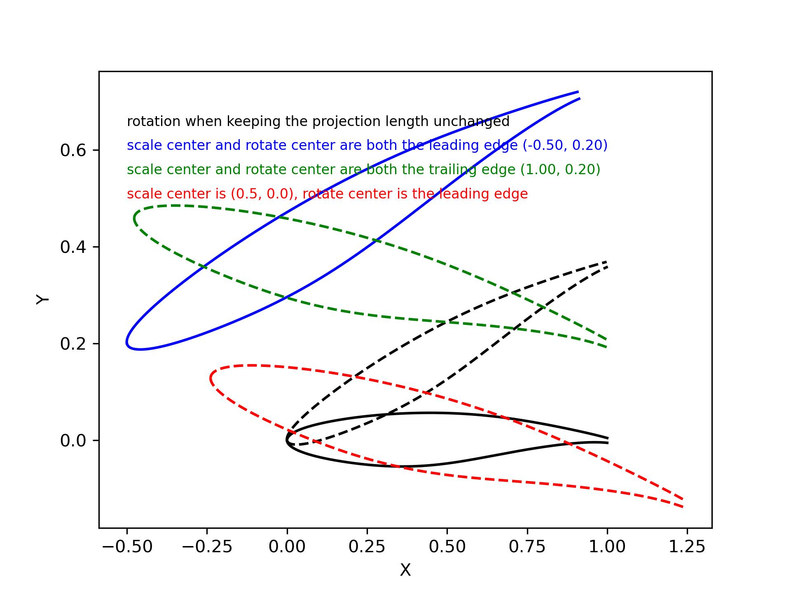
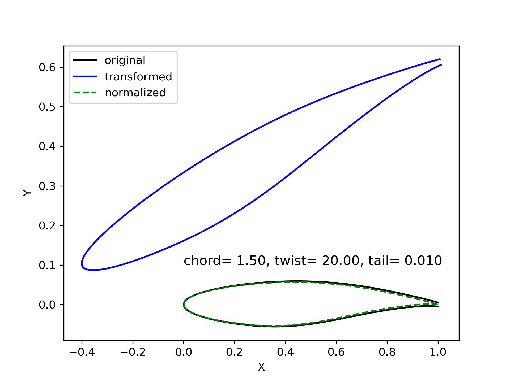
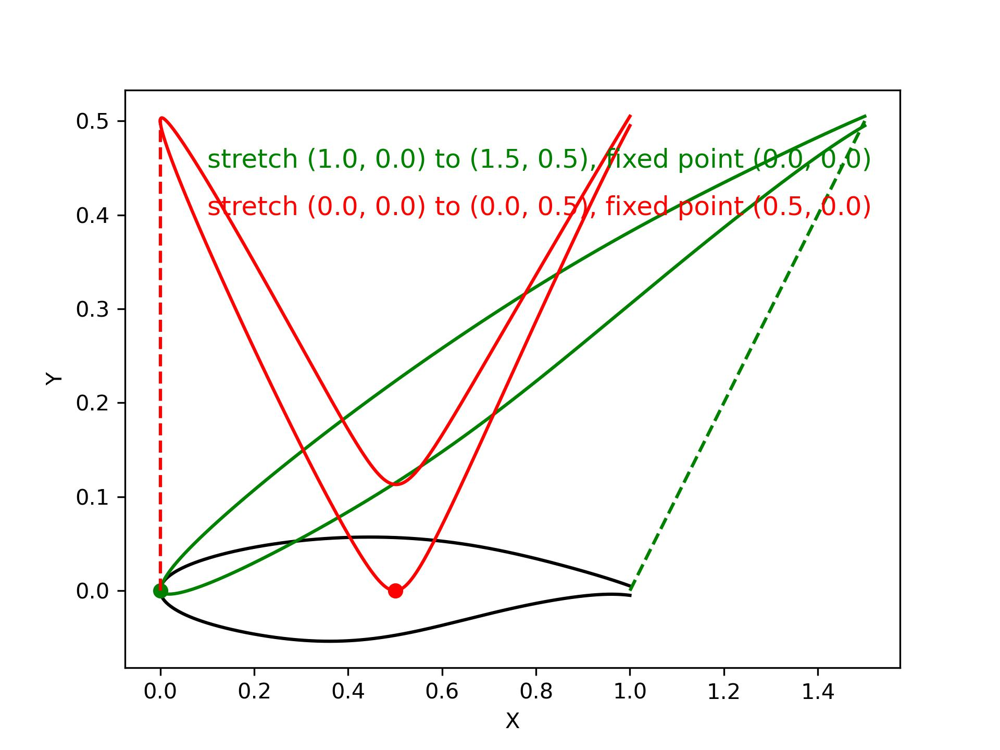
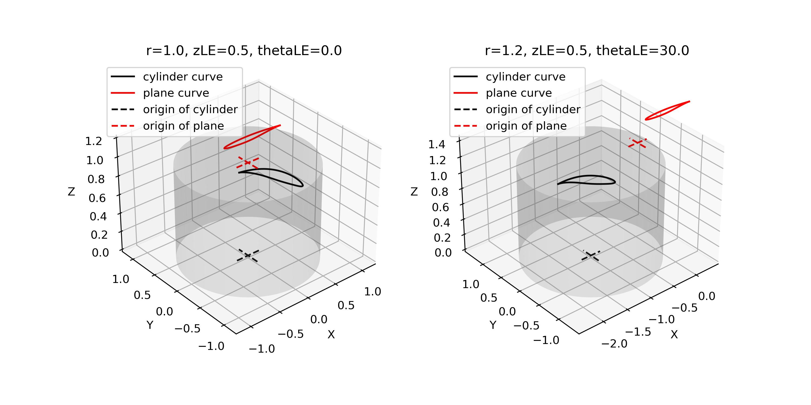

Curve transformation
=======================

Transform airfoil
------------------------

:numref:`transform_airfoil` shows the transformation of an airfoil. It takes three steps in order:
translation (`dx`, `dy`), scale (`scale`, `x0`, `y0`), and rotation (`rot`, `xr`, `yr`, `projection`).

.. code-block:: python
    :linenos:
    
    xu_, xl_, yu_, yl_ = transform(x0, x0, yu0, yl0, rot=20, projection=True)           # black

    xu_, xl_, yu_, yl_ = transform(x0, x0, yu0, yl0, scale=1.5, rot=20, 
        dx=xLE-0.0, dy=yLE-0.0, x0=None, y0=None, xr=None, yr=None, projection=False)   # blue

    xu_, xl_, yu_, yl_ = transform(x0, x0, yu0, yl0, scale=1.5, rot=-10, 
        dx=xTE-1.0, dy=yTE-0.0, x0=xTE, y0=yTE, xr=xTE, yr=yTE, projection=False)       # green

    xu_, xl_, yu_, yl_ = transform(x0, x0, yu0, yl0, scale=1.5, rot=-10,    
        dx=0.0, dy=0.0, x0=0.5, y0=0.0, xr=None, yr=None, projection=False)             # red

.. _transform_airfoil:

    Transform airfoil

There is also a function `rotate` that can rotate a curve about the `X`, `Y` or `Z` axis.

.. code-block:: python
    :linenos:

    x_, y_, z_ = rotate(x, y, z, angle=0.0, origin=[0.0, 0.0, 0.0], axis='X')

Normalize airfoil
------------------------

:numref:`normalize_airfoil` shows the normalization of any airfoil.

.. code-block:: python
    :linenos:
    
    xu_, yu_, xl_, yl_, twist, chord, tail = normalize_foil(xu, yu, xl, yl)

.. _normalize_airfoil:

    Normalize airfoil

Stretch curve
------------------------

:numref:`stretch_curve` shows the result of stretching a curve. 
It linearly stretch a curve when a certain point (`xf`, `yf`) is fixed.
The fixed point is suggested on one of the ends of the given curve.
Otherwise, it may gives counterintuitive results, e.g., the green and red curves.

.. code-block:: python
    :linenos:
    
    xu_, yu_ = stretch_fixed_point(x0, yu0, dx=dx, dy=dy, xm=xm, ym=ym, xf=xf, yf=yf) 

.. _stretch_curve:

    Stretch curve

Cylinder to plane
------------------------

When we have a model of compressor, fan or turbine, the control sections of the blade are 
usually defined on cylinders. The section curve can be sliced by a cylinder (radius is :math:`r_0`), 
the Cartesian coordinates are :math:`x, y, z`. We can transfer them to cylindrical coordinates 
:math:`r, \theta, z`. The transformation between cylindrical coordinates and Cartesian coordinates
is :eq:`cartesian2cylindrical`. 

.. math::
    & \left\{
        \begin{array}{ll}
            \theta &= \arctan (y/x) \\
            r &= \sqrt{x^2 + y^2} \\
            z &= z
        \end{array}
    \right.
    :label: cartesian2cylindrical

Then, we want to obtain the 2D curve on a X-Y plane, the coordinates are :math:`X, Y, Z`.
The transformation is defined by :eq:`cylinder2plane`. This shows that the 2D curve is on plane :math:`Z=r_0`.

.. math::
    & \left\{
        \begin{array}{ll}
            X &= r \cdot \theta \\
            Y &= z \\
            Z &= r
        \end{array}
    \right.
    :label: cylinder2plane

:numref:`cylinder_to_plane` shows the cylinder curve and the corresponding plane curve. 

.. code-block:: python
    :linenos:
    
    x, y, z = toCylinder(X, Y, Z, flip=False, origin=[0, 0])

    X, Y, Z = fromCylinder(x, y, z, flip=False, origin=[0, 0])

.. _cylinder_to_plane:

    Cylinder to plane

