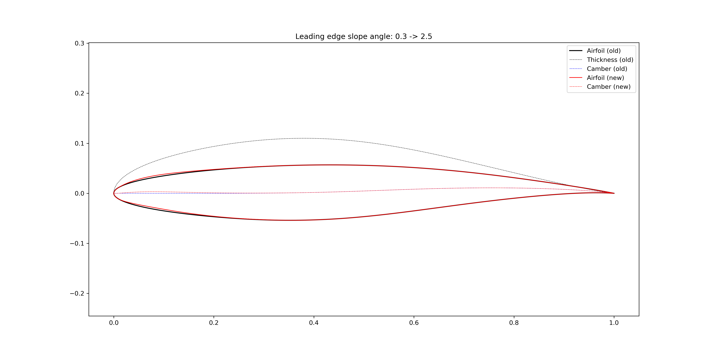
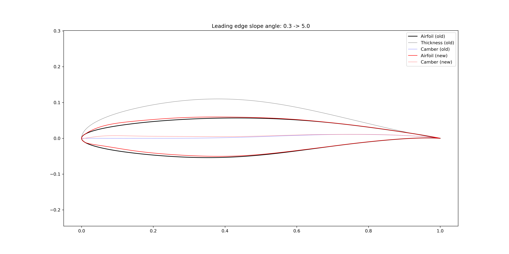
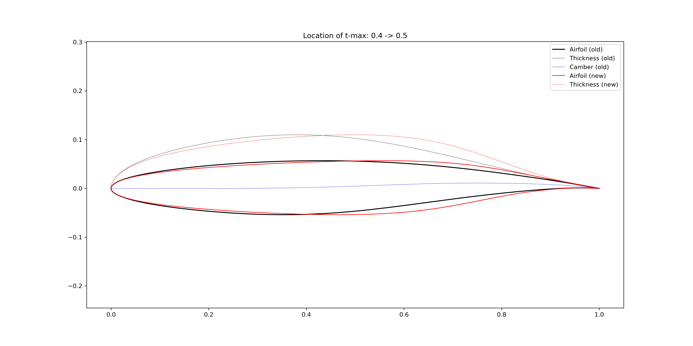
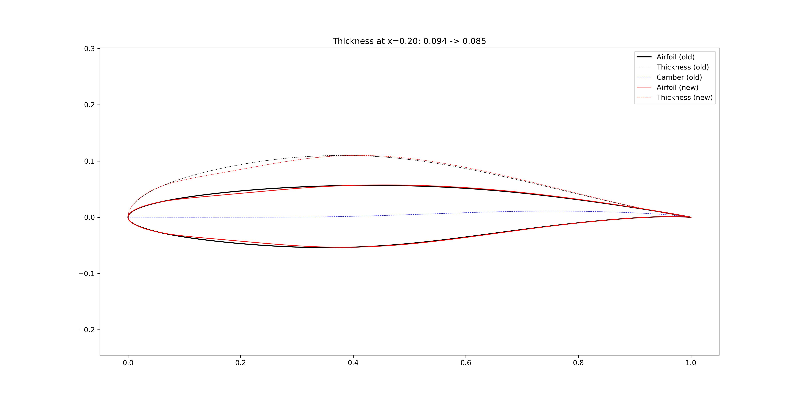
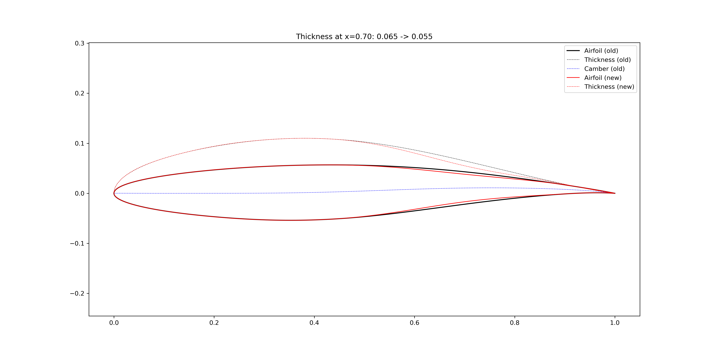
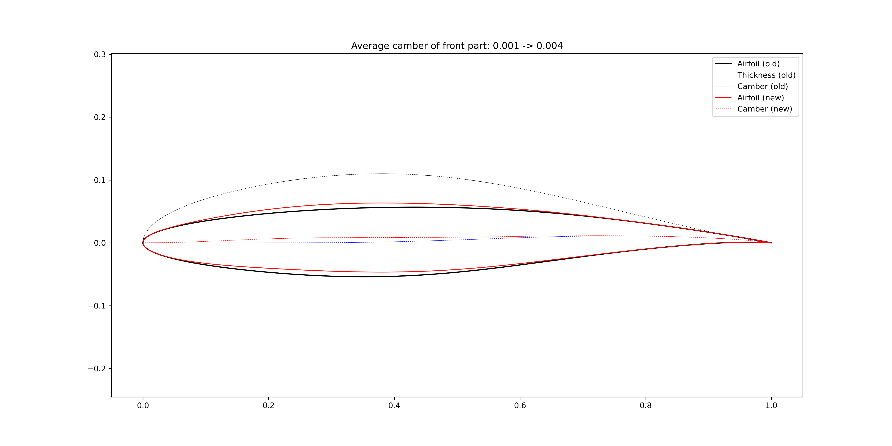
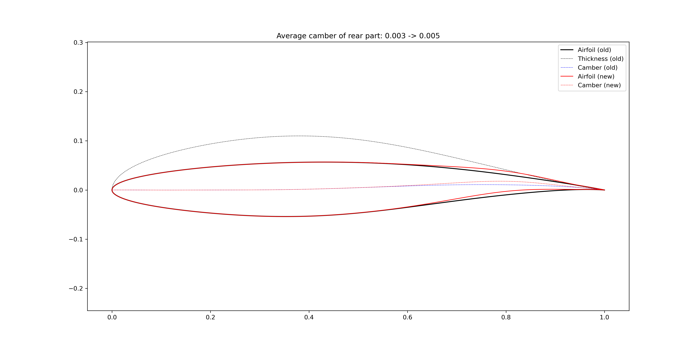

Airfoil feature and modification
==================================

Geometric features
------------------------

The :class:`FoilGeoFeatures <cst_modeling.foil.FoilGeoFeatures>` class
provides functions to extract geometric features from the airfoil data.

Geometric features:

- Leading edge radius
- Volume
- Thickness line
- Camber line
- Curvature
- Maximum thickness
- Thickness at 20% chord and 70% chord
- Maximum camber
- Average camber
- Weighted average camber
- Average camber of front 60% and rear 40%
- Leading edge slope angle
- Trailing edge wedge angle
- Trailing edge slope angle
- Upper crest point
- Lower crest point

.. figure:: ../../../example/airfoil-features/airfoil-geometric-features-tail-0.000.png
    :width: 90 %
    :align: center

    Airfoil geometric features (tail=0.000)

.. figure:: ../../../example/airfoil-features/airfoil-geometric-features-tail-0.004.png
    :width: 90 %
    :align: center

    Airfoil geometric features (tail=0.004)

Geometric modification
------------------------------

The :class:`FoilModification <cst_modeling.foil.FoilModification>` class
provides functions to add bumps and incremental curves to airfoil upper and lower surfaces,
or add bumps to the airfoil thickness line or camber line.
The modified geometry will be reconstructed by the CST method with the specified number of CST parameters.

In :numref:`airfoil_geo_modify_1`, a bump centered at :math:`x=0.30` are added to the airfoil upper surface,
and a bump centered at :math:`x=0.85` are added to the airfoil lower surface.
When the airfoil maximum thickness is kept the same, the lower surface is affected by adding the bump to the upper surface.

.. _airfoil_geo_modify_1:
.. figure:: ../../../example/airfoil-modification/airfoil-modify-bump.png
    :width: 90 %
    :align: center

    Add bumps to the airfoil surfaces (not keep the :math:`t_\text{max}`)

.. _airfoil_geo_modify_2:
.. figure:: ../../../example/airfoil-modification/airfoil-modify-bump-keep-tmax.png
    :width: 90 %
    :align: center

    Add bumps to the airfoil surfaces (keep the :math:`t_\text{max}`)

In :numref:`airfoil_geo_modify_3`, the airfoil camber is increased in a global sense by adding a bump centered at :math:`x=0.30`.
In :numref:`airfoil_geo_modify_4`, the airfoil camber is increased locally in the aft loading region,
a bump centered at :math:`x=0.80` is added to the airfoil camber line.

.. _airfoil_geo_modify_3:
.. figure:: ../../../example/airfoil-modification/airfoil-modify-camber-x-0.3.png
    :width: 90 %
    :align: center

    Increase airfoil camber in a global sense (bump center = 0.3)

.. _airfoil_geo_modify_4:
.. figure:: ../../../example/airfoil-modification/airfoil-modify-camber-x-0.8.png
    :width: 90 %
    :align: center

    Increase airfoil camber in the aft loading region (bump center = 0.8)

Leading edge modification
------------------------------

The :class:`FoilModification <cst_modeling.foil.FoilModification>` class
provides functions to modify global geometric features of airfoils.

**Leading edge radius**

In :numref:`airfoil_feature_modify_1`, the airfoil leading edge radius is increased
by adding a bump centered at :math:`x=0.005` to the airfoil thickness line.
Similarly, the radius can be reduced, as shown in :numref:`airfoil_feature_modify_2`.

.. _airfoil_feature_modify_1:
.. figure:: ../../../example/airfoil-modification/airfoil-modify-rLE-0.016.png
    :width: 90 %
    :align: center

    Increase airfoil leading edge radius

.. _airfoil_feature_modify_2:
.. figure:: ../../../example/airfoil-modification/airfoil-modify-rLE-0.005.png
    :width: 90 %
    :align: center

    Reduce airfoil leading edge radius

**Leading edge slope angle**

In :numref:`airfoil_feature_modify_3`, the airfoil leading edge slope angle is increased
by adding a bump centered at :math:`x=0.05` to the airfoil camber line.
The bump width is 0.6 so that the modification is more locally.
In :numref:`airfoil_feature_modify_4`, the bump width is increased to 1.0.

.. _airfoil_feature_modify_3:

    Increase airfoil leading edge slope angle (bump width = 0.6)

.. _airfoil_feature_modify_4:

    Increase airfoil leading edge slope angle (bump width = 1.0)

Trailing edge modification
------------------------------

The :class:`FoilModification <cst_modeling.foil.FoilModification>` class
provides functions to modify global geometric features of airfoils.

**Wedge angle**

.. _airfoil_feature_modify_5:
.. figure:: ../../../example/airfoil-modification/airfoil-modify-TE-wedge-angle-14.7.png
    :width: 90 %
    :align: center

    Increase airfoil trailing edge wedge angle

.. _airfoil_feature_modify_6:
.. figure:: ../../../example/airfoil-modification/airfoil-modify-TE-wedge-angle-2.6.png
    :width: 90 %
    :align: center

    Reduce airfoil trailing edge wedge angle

**Slope angle**

.. _airfoil_feature_modify_7:
.. figure:: ../../../example/airfoil-modification/airfoil-modify-TE-slope-angle-14.1.png
    :width: 90 %
    :align: center

    Increase airfoil trailing edge slope angle

.. _airfoil_feature_modify_8:
.. figure:: ../../../example/airfoil-modification/airfoil-modify-TE-slope-angle-1.2.png
    :width: 90 %
    :align: center

    Reduce airfoil trailing edge slope angle

Maximum thickness location
------------------------------

The :class:`FoilModification <cst_modeling.foil.FoilModification>` class
provides functions to modify global geometric features of airfoils.

The maximum location is changed by transforming the x coordinates.
The details can be found in :class:`CoordinateTransformation <cst_modeling.math.CoordinateTransformation>`.

.. _airfoil_feature_modify_9:
.. figure:: ../../../example/airfoil-modification/airfoil-modify-x_tmax-0.3.png
    :width: 90 %
    :align: center

    Transform the airfoil maximum thickness location to 30% chord

.. _airfoil_feature_modify_10:

    Transform the airfoil maximum thickness location to 50% chord

Thickness at certain locations
---------------------------------

The :class:`FoilModification <cst_modeling.foil.FoilModification>` class
provides functions to modify global geometric features of airfoils.

The thickness is modified by adding bumps to the thickness line.

.. _airfoil_feature_modify_11:

    Change the airfoil thickness at x=0.20

.. _airfoil_feature_modify_12:

    Change the airfoil thickness at x=0.70

Average camber
----------------

The :class:`FoilModification <cst_modeling.foil.FoilModification>` class
provides functions to modify global geometric features of airfoils.

The camber is modified by adding bumps to the camber line.

.. _airfoil_feature_modify_13:

    Change the airfoil average camber of the front 60%

.. _airfoil_feature_modify_14:

    Change the airfoil average camber of the rear 40%

