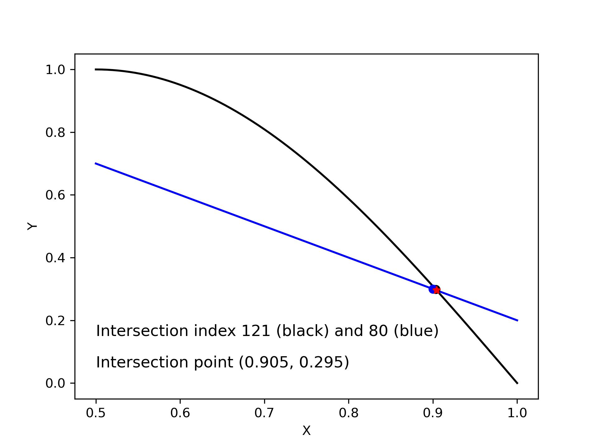
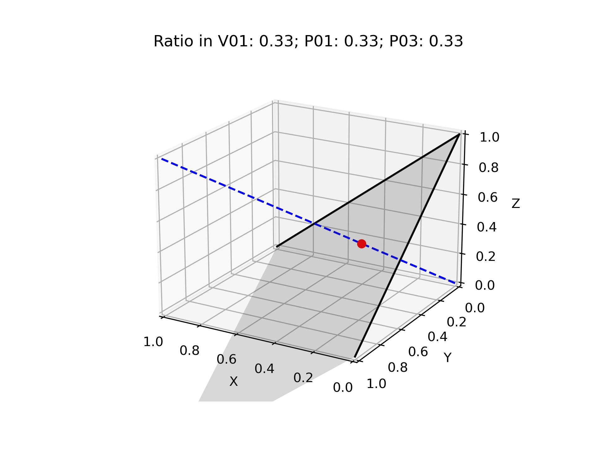
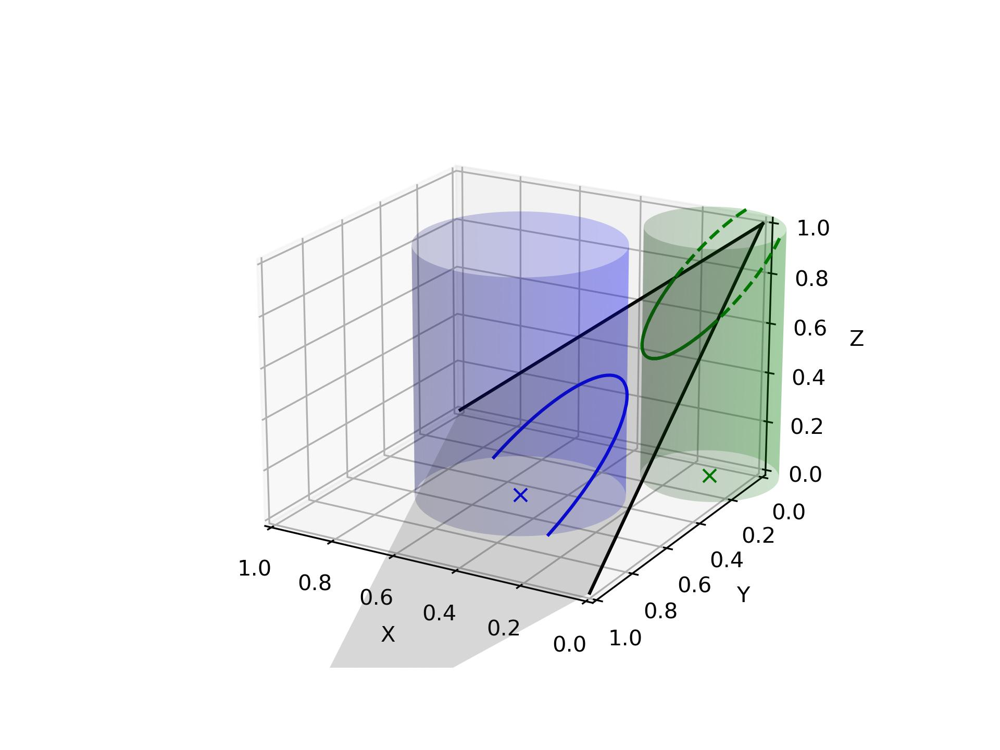

Intersection
========================

Intersection between curves
--------------------------------------

:numref:`intersection_curve` shows the index of the point nearest to the intersection on each curve,
and the intersection point calculated by the two local segments.
Function `intersect_point` can calculate the intersection points of multiple pairs of segments at the same time.

.. code-block:: python
    :linenos:
    
    i1, i2, points = intersect_index(x1, y1, x2, y2)

    intersection = intersect_point(p1, p2, p3, p4)

.. _intersection_curve:

    Intersection between curves

Intersection: vector v.s. plane
---------------------------------------

:numref:`intersection_vector_plane` shows the intersection point between a vector and a plane.
The plane `P0123` is defined by three points `P0, P1, P3`, the vector `V01` is defined by two points `V0, V1`.
Function `intersect_vec_plane` calculates the intersection point `xi`, 
and its ratio in the `V01`, `P01`, `P03` directions. 

- If `rv` is not in `[0,1]`, then the segment `V01` does not intersect with the plane `P0123`. 
- If `t1, t3` are not in `[0,1]`, then vector `V01` does not intersect with the quadrangle `P0123`.

.. code-block:: python
    :linenos:
    
    xi, t1, t3, rv = intersect_vec_plane(V0, V1, P0, P1, P3)

.. _intersection_vector_plane:

    Intersection between vector and plane

Intersection: surface v.s. plane
---------------------------------------

:numref:`intersection_surface_plane` shows the intersection point between surfaces and a plane.
The plane `P0123` is defined by three points `P0, P1, P3`. The surface is an array `surface [ni,nj,3]`.
Function `intersect_surface_plane` calculates the intersection points `curve`, 
the index of the point in surface to the intersection curve (`ij_curve`),
and the ratio of intersection points in the `P01`, `P03` directions (`xi_curve`, `yt_curve`). 

.. code-block:: python
    :linenos:
    
    curve, ij_curve, xi_curve, yt_curve = intersect_surface_plane(
        surface, P0, P1, P3, within_bounds=True, original_order=False)

.. _intersection_surface_plane:

    Intersection between surface and plane

Slice curve from surface results
---------------------------------------

Slice the surface result (in Tecplot format) by a plane (`locations`, `Pref`, `dir_norm`), 
and extract data from the surface. 

.. code-block:: python
    :linenos:
    
    sections, name_var = extract_slice(locations, Pref, dir_norm, 
            dir_ref=np.array([1.,0.,0.]), fname='surface-aircraft.dat', 
            zone_id=[], index_xyz=[0,1,2], arrange_method='join')
    