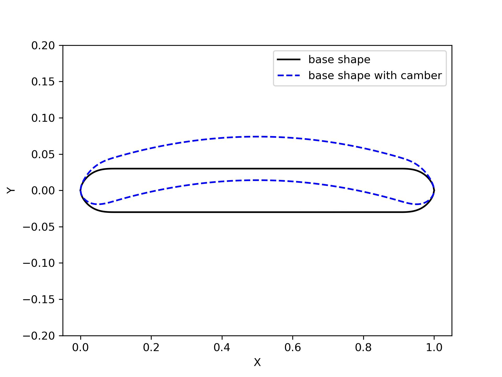
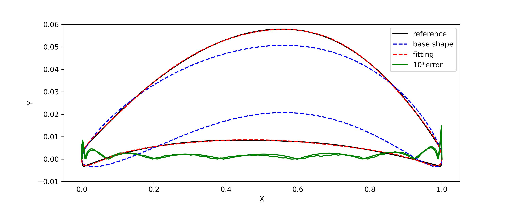

Section
========================

Class: BasicSection
----------------------

`BasicSection` is the parent class that contains information of one curve.

The 3D curve coordinates `x, y, z` are transformed from a unit 2D curve.
The 2D curve coordinates are either `xx, yy` (an open curve) or `xx, yu, yl` (a closed curve).
A unit 2D curve means it chord length is 1, i.e., `xx[0]=0, xx[-1]=1`.

The 2D-to-3D transformation is defined by:

- the 3D location of the leading point (`xLE, yLE, zLE`);
- the chord length `chord`, i.e., :math:`|| \mathbf{x}_\text{LE} - \mathbf{x}_\text{TE} || = \text{chord}`;
- the twist angle `twist` (deg) defining the curve rotation about Z-axis (right hand rule);
- a flag `lTwistAroundLE` specifies the rotation center being LE or TE;
- an optional float `thick_set` that specifies the maximum relative thickness of the closed curve.

The 2D-to-3D transformation is applied when calling `BasicSection.section()`.

.. code-block:: python
    :linenos:

    sec = BasicSection(thick=None, chord=2.0, twist=-3.0, lTwistAroundLE=False)

    sec.xx = np.linspace(0, 1, 101)
    sec.yy = np.sin(np.pi*sex.xx)

    sec.xLE = 1.0
    sec.yLE = 0.0
    sec.zLE = 1.0

    sec.section(flip_x=False, projection=True)

Class: OpenSection
----------------------

`OpenSection` is a child class of `BasicSection`, which uses CST method for constructing
the unit 2D **open curve**. The `OpenSection.section()` automatically construct the 2D curve 
and transform it to the 3D curve.

.. code-block:: python
    :linenos:

    sec = OpenSection(thick=None, chord=2.0, twist=-3.0, lTwistAroundLE=False)
    
    sec.section(cst=cst, nn=1001, flip_x=False, projection=True)

Several additional attributes are available:

- the CST coefficients of the curve `cst`;
- the refinement CST coefficients `refine`.

Class: Section
----------------------

`Section` is a child class of `BasicSection`, which uses CST method for constructing
the unit 2D airfoil, i.e., a **closed curve**. The `Section.section()` automatically construct the 2D airfoil 
and transform it to the 3D curve.

.. code-block:: python
    :linenos:

    sec = Section(thick=None, chord=2.0, twist=-3.0, tail=0.01, lTwistAroundLE=False)
    
    sec.section(cst_u=cst_u, cst_l=cst_l, nn=1001, flip_x=False, projection=True)

Several additional attributes are available:

- a float `tail` specifies the airfoil tail thickness;
- the airfoil leading edge radius `RLE`;
- the airfoil trailing edge angle `te_angle` (deg);
- the slope of the mean camber line at trailing edge `te_slope`, i.e., :math:`dy/dx`;
- the CST coefficients of the upper and lower surface `cst_u, cst_l`;
- the refinement CST coefficients `refine_u, refine_l`.

Class: RoundTipSection
----------------------

`RoundTipSection` is a child class of `BasicSection`. The unit 2D **closed curve**
is a combination of a base shape (:numref:`base_shape`) and a CST airfoil.
This class is suitable for round trailing edge foils, blades, or plates.

.. _base_shape:

    Base shape function

.. code-block:: python
    :linenos:

    sec = RoundTipSection(xLE, yLE, zLE, chord, thick, twist, tail,
                cst_u, cst_l,
                base_le_ratio, base_te_ratio, base_abs_thick, 
                base_le_radius, base_te_radius,
                aLE=0.0, aTE=0.0, i_split=None, nn=501, lTwistAroundLE=False)

    sec.section(flip_x=False, projection=True)

Compared with `Section`, several additional parameters are needed:

- relative leading edge radius of the base shape `base_le_radius`;
- relative trailing edge radius of the base shape `base_te_radius`;
- actual thickness of the base shape `base_abs_thick`;
- ratio of the leading edge and trailing edge region `base_le_ratio`, `base_te_ratio`;
- angle `aLE` (deg) of the slope at leading edge, i.e., :math:`dy/dx`;
- angle `aLE` (deg) of the slope at leading edge, i.e., :math:`dy/dx`;

Fitting blade with RoundTipSection
------------------------------------

Given a blade (round tips at both ends), you also can use `RoundTipSection` for fitting.
Compared with the direct use of CST fitting (:numref:`fitting_blade`), 
`RoundTipSection` is more suitable for thin plate.

.. _fitting_blade_RoundTipSection:

    Fitting blade with RoundTipSection

.. code-block:: python
    :linenos:

    xx, y_base_shape = RoundTipSection.base_shape()
    dy_base_shape = RoundTipSection.base_camber()

    yu_cst = yu_ref - (  y_base_shape - dy_base_shape)
    yl_cst = yl_ref - (- y_base_shape - dy_base_shape)

    cst_u, cst_l = cst_foil_fit(xx, yu_cst, xx, yl_cst, n_cst=7, xn1=0.1, xn2=0.1)

